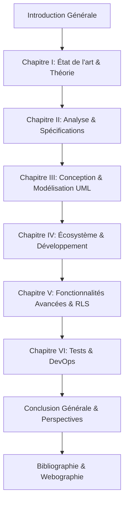

# Guide d'Impression et de Finalisation du Mémoire : Djorssi-Match

Félicitations ! Le mémoire complet de votre projet **Djorssi-Match** est maintenant entièrement rédigé, synchronisé avec votre codebase et compilé dans un format académique de très haute qualité.

## 📁 Fichiers Disponibles dans votre Espace de Travail

Tous les fichiers nécessaires pour votre soutenance et votre rapport écrit sont localisés sous le dossier [memoire/](file:///Users/mac/DJORSSI-MATCH/memoire/) :

1. **[memoire_complet.md](file:///Users/mac/DJORSSI-MATCH/memoire/memoire_complet.md)** : Le texte intégral de votre mémoire au format Markdown (77.6 Ko), structuré selon les standards universitaires les plus stricts en français.
2. **[compile_html.py](file:///Users/mac/DJORSSI-MATCH/memoire/compile_html.py)** : Le script d'automatisation Python qui convertit votre fichier Markdown en un document HTML académique avec style haute fidélité.
3. **[memoire_complet.html](file:///Users/mac/DJORSSI-MATCH/memoire/memoire_complet.html)** : Le fichier HTML final prêt à être ouvert dans votre navigateur web pour relecture, rendu des diagrammes Mermaid UML dynamiques, et impression/export PDF direct.

---

## 🚀 Étape 1 : Visualisation et Rendu du Mémoire

Pour voir le rendu visuel haut de gamme de votre mémoire :
- Ouvrez le fichier **[memoire_complet.html](file:///Users/mac/DJORSSI-MATCH/memoire/memoire_complet.html)** dans n'importe quel navigateur moderne (Chrome, Safari, Firefox).
- Le document est formaté avec des polices de caractères premium de type Serif (*Crimson Pro* et *Georgia*), des paragraphes justifiés avec retraits de première ligne réglementaires, des tableaux stylisés et des titres sans-serif (*Inter*) élégants.
- **Diagrammes UML Interactifs** : Les diagrammes de cas d'utilisation, de séquence, de classes et d'états-transitions sont dessinés dynamiquement en haute définition grâce à la bibliothèque *Mermaid.js* intégrée.

---

## 📸 Étape 2 : Insertion des Captures d'Écran Applicatives

Pour rendre votre mémoire digne d'un niveau professionnel, des encadrés roses en pointillés indiquent exactement où insérer vos captures d'écran de l'application mobile Flutter et du dashboard d'administration React.

Dans le document, repérez les placeholders suivants et remplacez-les par vos propres images :

### Écrans Mobiles (Chapitre IV, Section 4.1.3)
- **Capture 1 :** L'écran de balayage principal (`SwipeScreen`) montrant les cartes d'offres d'emploi défilantes avec le score de compatibilité (matching score) en couleur.
- **Capture 2 :** L'écran de profil candidat (`ProfileScreen`) affichant la biographie, les tags des compétences sélectionnées et le bouton de téléversement de CV.
- **Capture 3 :** L'écran magique de Match (*"It's a Match !"*) qui apparaît lorsque le recruteur valide le candidat, avec les boutons directs WhatsApp, Téléphone et E-mail.

### Dashboard Web Admin (Chapitre IV, Section 4.4)
- **Capture 4 :** La page d'accueil de la console React d'administration (`AdminDashboard`) montrant les graphiques statistiques de répartition des candidats et des abonnés premium.
- **Capture 5 :** L'écran de gestion et d'émission des notifications push avec l'aperçu mobile interactif.

> [!TIP]
> Pour intégrer les images directement dans le HTML final, vous pouvez remplacer le code des encadrés par une balise standard ``.

---

## 🖨️ Étape 3 : Exportation en PDF ou Microsoft Word

### Option A : Export PDF Direct (Recommandé)
Le fichier HTML intègre une feuille de style d'impression qui respecte les sauts de page réglementaires avant chaque chapitre et désactive les boutons d'interface.
1. Ouvrez **[memoire_complet.html](file:///Users/mac/DJORSSI-MATCH/memoire/memoire_complet.html)** dans votre navigateur.
2. Cliquez sur le bouton bleu flottant en bas à droite : **"Exporter en PDF / Imprimer"**.
3. Dans la boîte de dialogue d'impression de votre système :
   - Destination : **Enregistrer au format PDF**
   - Mise en page : **Portrait**
   - Marges : **Par défaut** (ou personnalisées si votre université exige des dimensions spécifiques pour la reliure)
   - Options : Cochez **"Graphiques d'arrière-plan"** (indispensable pour afficher la couleur des tableaux et les styles de diagrammes).
4. Cliquez sur **Enregistrer** !

### Option B : Importation sous Microsoft Word ou Google Docs
Si vous devez effectuer des ajustements textuels manuels ou ajouter des numéros de page complexes :
1. Lancez Microsoft Word ou Google Docs.
2. Ouvrez ou importez directement le fichier **[memoire_complet.html](file:///Users/mac/DJORSSI-MATCH/memoire/memoire_complet.html)**.
3. Word conservera l'intégralité de la structure sémantique (Titres H1-H6, paragraphes, listes, tableaux). Vous n'aurez qu'à générer la table des matières en un clic via l'onglet *Références > Table des matières*.

---

## 🎓 Structure Finale Rédigée du Rapport

Le mémoire s'articule autour d'une logique rigoureuse de **77.6 Ko** de texte rédigé en français académique :

L'ensemble de ce travail a été calqué de façon méticuleuse sur les réalités de votre projet : votre framework Flutter (ValueNotifiers), votre backend Supabase (RLS et Edge Functions), le scraping Python asynchrone orchestré avec l'IA locale Ollama (Qwen2.5) et les passerelles de paiements mobiles locales (GeniusPay et MoyaPay).

Vous disposez d'un document complet, conforme aux exigences d'une soutenance universitaire majeure.
