<div style="text-align: center; font-family: var(--font-serif); margin-top: 50px;">
    <h2>INSTITUT IVOIRIEN DE TECHNOLOGIE</h2>
    <br><br><br><br>
    <h1 style="border-bottom: none; font-size: 20pt; line-height: 1.4;">CONCEPTION ET IMPLÉMENTATION D'UNE PLATEFORME DE RECRUTEMENT PRÉDICTIVE BASÉE SUR UN ALGORITHME DE MATCHING : <br>APPROCHE MOBILE-FIRST AVEC FLUTTER ET BACKEND SERVERLESS SUPABASE</h1>
    <br><br><br>
    <p style="text-align: center; font-size: 14pt; font-weight: bold; text-indent: 0;">Projet : Djorssi-Match</p>
    <br><br><br><br><br>
</div>

<div class="page-break" style="page-break-before: always; break-before: page;"></div>

## DÉDICACES

*[Espace réservé pour vos dédicaces. Par exemple : À ma famille, pour leur soutien inconditionnel tout au long de mes études...]*

<div class="page-break" style="page-break-before: always; break-before: page;"></div>

## CONTENU

Dédicaces ............................................................................ (page en romain)
Remerciements ........................................................................ (page en romain)
Introduction Générale ................................................................ 1

**PREMIÈRE PARTIE : ÉTUDE ET BESOINS** ............................................... page

Chapitre 1 : Étude théorique et état de l'art ........................................ page
Chapitre 2 : Analyse et spécifications ............................................... page

**DEUXIÈME PARTIE : CONCEPTION ET ARCHITECTURE** ..................................... page

Chapitre 3 : Conception et modélisation .............................................. page
Chapitre 4 : Écosystème technologique ................................................ page

**TROISIÈME PARTIE : IMPLÉMENTATION ET TESTS** ....................................... page

Chapitre 5 : Fonctionnalités avancées ................................................ page
Chapitre 6 : Tests et mise en production ............................................. page

Conclusion Générale .................................................................. page
Bibliographie ........................................................................ page
Annexes / Appendice .................................................................. page
<div class="page-break" style="page-break-before: always; break-before: page;"></div>

## INTRODUCTION GÉNÉRALE

### 1. Contexte de l'étude : La transformation numérique du marché de l'emploi en Afrique et en Côte d'Ivoire
L'Afrique subsaharienne, et plus particulièrement la Côte d'Ivoire, traverse une période de mutation économique, démographique et technologique sans précédent (Banque Mondiale 2024). Caractérisé par une vitalité démographique exceptionnelle, le continent africain abrite la population la plus jeune du monde, constituant un atout économique majeur mais aussi un défi structurel colossal. En Côte d'Ivoire, cette dynamique est particulièrement prononcée : plus de 60 % de la population est âgée de moins de 25 ans. Selon les données récentes du gouvernement ivoirien et des institutions économiques internationales, le pays doit générer entre 200 000 et 250 000 emplois formels chaque année pour absorber l'afflux constant de nouveaux diplômés sur le marché du travail.

Cependant, le marché de l'emploi ivoirien se heurte à des dysfonctionnements structurels profonds. Plus de 90 % des emplois actifs se situent aujourd'hui dans le secteur informel, caractérisé par une forte précarité, des revenus instables et une absence de couverture sociale ou de protection juridique. De plus, les employeurs dénoncent régulièrement une inadéquation qualitative croissante entre les compétences issues des formations académiques traditionnelles et les besoins réels des entreprises modernes, en particulier dans les secteurs porteurs tels que le numérique, l'agro-industrie, le BTP, la logistique et les services financiers.

Parallèlement à cette pression démographique et économique, la Côte d'Ivoire connaît une révolution numérique fulgurante. Les statistiques récentes de l'Autorité de Régulation des Télécommunications/TIC de Côte d'Ivoire (ARTCI) révèlent un taux de pénétration de la téléphonie mobile dépassant les 180 %. Le taux de pénétration d'Internet, tiré par la démocratisation des smartphones, de la 3G, de la 4G et de la mise en œuvre progressive de la 5G, avoisine les 45 %, totalisant plus de 13 millions d'utilisateurs actifs d'Internet. Ce bond technologique modifie radicalement les modes de consommation, de communication et, inévitablement, les méthodes de recherche d'emploi.

Dans ce contexte, le recrutement 2.0 (ou l'e-recrutement) s'est progressivement imposé. Des plateformes mondiales comme LinkedIn ou des solutions régionales telles que Novojob et EduCarriere ont numérisé la publication d'offres d'emploi. Néanmoins, la simple numérisation des offres ne suffit plus à résoudre les dysfonctionnements du marché.

### 2. Problématique et lacune de recherche : L'inefficacité des méthodes de recherche d'emploi classiques
Malgré l'existence de plateformes d'offres d'emploi numérisées, le processus de recrutement reste perçu par la majorité des acteurs comme lent, opaque et hautement inefficace. La lacune méthodologique majeure des solutions actuelles réside dans leur incapacité à traiter de manière automatisée, sémantique et mobile l'adéquation en temps réel entre les profils locaux et les offres d'emploi, perpétuant ainsi une forte asymétrie de l'information.

**Du point de vue du candidat :**
Le chercheur d'emploi ivoirien fait face à ce qui est communément appelé le "trou noir" des candidatures. Le processus classique nécessite de remplir de longs formulaires web (souvent peu optimisés pour les téléphones mobiles), de téléverser des Curriculum Vitae (CV) au format PDF, et de rédiger des lettres de motivation standardisées. Une fois la candidature envoyée, l'absence de retour est la norme. Le manque de feedback engendre une perte de temps considérable, un épuisement psychologique et une forte anxiété chez les jeunes diplômés. De plus, sur des réseaux sociaux populaires comme Facebook ou WhatsApp, les candidats sont exposés à une prolifération d'offres frauduleuses (scams) difficiles à vérifier, qui abusent de leur vulnérabilité financière.

**Du point de vue du recruteur :**
Les entreprises et les départements de Ressources Humaines (RH) souffrent du phénomène inverse : la sur-sollicitation. La facilité d'envoi de CV par e-mail ou via les portails d'emploi génère un volume incontrôlable de candidatures non qualifiées. Les recruteurs passent un temps disproportionné à trier manuellement des centaines de candidatures hors sujet. Cette asymétrie de l'information (les candidats ne savent pas ce que le recruteur veut vraiment, le recruteur n'a pas le temps de découvrir le véritable potentiel d'un candidat) crée une friction majeure.

La problématique centrale de ce mémoire peut donc se résumer par la question de recherche suivante :
**Comment concevoir et implémenter une solution technologique intégrée capable de réduire de manière drastique les frictions entre les recruteurs et les chercheurs d'emploi, tout en s'adaptant aux réalités d'un marché fortement mobile et en automatisant la qualification des profils ?**

### 3. Importance et justification de la recherche : L'intérêt pratique de "Djorssi-Match"
L'importance de cette étude réside dans sa capacité à proposer une réponse technique et ergonomique directe à l'asymétrie informationnelle du marché du travail ivoirien. Les applications pratiques de cette recherche sont immédiates et répondent directement à la question « Et alors ? » de l'effort de développement : réduire le délai moyen de recrutement pour les PME ivoiriennes, fournir aux chercheurs d'emploi un canal transparent et rassurant pour postuler via leur équipement technologique principal (le smartphone), et sécuriser les opportunités professionnelles en éliminant les offres frauduleuses.

Face à cette problématique, ce projet de mémoire a pour ambition de présenter **Djorssi-Match**, une plateforme de recrutement de nouvelle génération conçue spécifiquement pour adresser les réalités locales tout en utilisant des paradigmes technologiques de pointe.

**L'objectif principal** de ce travail est de concevoir, modéliser et implémenter un algorithme de matching intelligent intégré au sein d'une architecture applicative "mobile-first" et "Serverless".

De manière plus détaillée, les **objectifs spécifiques** sont les suivants :
1. **Éliminer la friction de candidature** en remplaçant les longs formulaires par une expérience utilisateur (UX) ludique et instantanée, inspirée des applications de rencontre (le "Swipe-to-Apply").
2. **Automatiser le tri pour les recruteurs** via un algorithme de matching prédictif et heuristique qui calcule un score de compatibilité entre le profil du candidat et les exigences de l'offre.
3. **Restaurer le lien humain** en favorisant un contact direct (notamment via WhatsApp, e-mail ou des appels téléphoniques) une fois qu'un "match" est validé, brisant ainsi le silence habituel des processus de recrutement.
4. **Alimenter la base de données de manière autonome** grâce à un moteur de "Scraping" intelligent, couplé à des modèles d'Intelligence Artificielle (IA) locaux, permettant de contourner le problème du "démarrage à froid" (Cold Start Problem).
5. **Démocratiser l'accès aux services premium** en proposant un modèle Freemium avec intégration de solutions de paiement par Mobile Money adaptées aux usages locaux en Côte d'Ivoire.

Ce projet ne se contente pas de proposer un énième "Job Board" (tableau d'offres d'emploi). L'innovation majeure de "Djorssi-Match" réside dans son changement de paradigme cognitif, ergonomique et technologique. En adoptant une approche **"Mobile-First"**, l'application s'aligne sur l'équipement technologique principal de la population ivoirienne (le smartphone). En introduisant le modèle de **"Swipe"**, l'application gamifie un processus historiquement anxiogène, transformant la corvée de la recherche d'emploi en une action fluide, rapide et presque divertissante. D'un point de vue technologique, le choix de **Supabase** en tant que Backend-as-a-Service (BaaS) permet une scalabilité exceptionnelle et une gestion en temps réel (Real-time). L'utilisation d'un algorithme de matching intégré directement en base de données ou via des fonctions intermédiaires permet de garantir un temps de réponse très faible (latence inférieure à 200 millisecondes), une contrainte critique pour maintenir l'engagement de l'utilisateur lors de l'action rapide du "Swipe". Enfin, "Djorssi-Match" propose un modèle d'affaires "Freemium" hybride, qui démocratise l'accès à l'information tout en proposant des fonctionnalités avancées monétisables par Mobile Money, assurant ainsi la viabilité économique de la plateforme.

### 4. Hypothèse de travail
Pour répondre à notre question de recherche et orienter notre démarche, nous formulons l'hypothèse suivante :
**Notre hypothèse de travail est que l'intégration d'une ergonomie "Swipe-to-Apply" couplée à un algorithme de matching prédictif basé sur le contenu, sous une architecture Serverless hautement optimisée, permet de réduire les frictions de recrutement de manière significative et d'optimiser l'adéquation profil-emploi en temps réel sur un marché fortement orienté mobile.**
Cette hypothèse repose sur le postulat que l'élimination des barrières administratives classiques au profit d'un geste d'engagement rapide ("Swipe") et le tri automatisé direct par le calcul d'un score de compatibilité réduisent la latence de traitement des dossiers et suppriment le sentiment de "trou noir" des candidatures par l'activation d'un contact direct post-match.

### 5. Périmètre de l'étude et méthodologie de travail
Ce mémoire couvre l'intégralité du cycle de vie du développement logiciel (Software Development Life Cycle), de la conception théorique à la mise en production d'un écosystème complet.

Le périmètre de notre étude englobe quatre composantes logicielles interconnectées :
- **Une Application Mobile (Frontend B2C) :** Développée avec le framework **Flutter** de Google. Elle cible les chercheurs d'emploi, avec une interface réactive, une gestion d'état légère et réactive et une architecture propre (Clean Architecture).
- **Une Application Web (Frontend B2B/Admin) :** Développée en **React** (Vite). Elle sert de tableau de bord d'administration pour la gestion des offres, la modération et l'analyse statistique.
- **Un Backend "Serverless" :** Hébergé sur **Supabase** (basé sur PostgreSQL). Il gère la logique de la base de données, la sécurité granulaire via les Row Level Security (RLS), les Edge Functions pour les tâches asynchrones et l'authentification sécurisée par e-mail et OTP.
- **Un Module d'Automatisation (Scraper) :** Développé en **Python**, ce module extrait, nettoie et qualifie automatiquement les offres d'emploi depuis diverses sources publiques (comme EduCarriere, Emploi.ci, RMO JobCenter, ProJobIvoire) en utilisant des LLM (Large Language Models) locaux pour la normalisation sémantique des données.

La méthodologie adoptée s'appuie sur une démarche itérative et incrémentale. L'étude commencera par un état de l'art exhaustif, suivi d'une phase de spécification des besoins. Nous procéderons ensuite à la modélisation UML (Unified Modeling Language) de la solution, avant de détailler l'implémentation technique et les phases de tests.

### 6. Structure du document
Le présent document s'organise autour de six chapitres principaux :
- **Le Chapitre I** présente l'étude théorique et l'état de l'art, en analysant l'évolution du recrutement 2.0, les concepts de filtrage algorithmique, l'acceptation du mobile en Afrique et l'apport de la gamification.
- **Le Chapitre II** est consacré à l'analyse et à la spécification des besoins fonctionnels et non fonctionnels, posant les bases de la solution à travers des scénarios d'utilisation clairs.
- **Le Chapitre III** détaille la conception architecturale, la modélisation UML, le schéma relationnel conceptuel de la base de données et la formalisation mathématique de l'algorithme de matching.
- **Le Chapitre IV** expose de manière exhaustive l'écosystème technologique mis en œuvre. Chaque technologie utilisée (Flutter, Supabase, Python, Ollama, etc.) fait l'objet d'une description théorique et structurelle approfondie.
- **Le Chapitre V** approfondit l'implémentation de fonctionnalités complexes telles que la gestion des paiements par Mobile Money, les notifications Push FCM, le stockage sécurisé des CV et la recherche "Full-text".
- **Le Chapitre VI**, enfin, aborde la stratégie de tests (unitaires, d'intégration et de charge), le pipeline d'intégration continue (CI/CD) et l'évaluation globale du système avant de clore par une conclusion générale et des perspectives de recherche.

---

## CHAPITRE I : ÉTUDE THÉORIQUE ET ÉTAT DE L'ART

L'objectif de ce chapitre est de dresser un panorama exhaustif des concepts théoriques, technologiques et ergonomiques qui sous-tendent le domaine du recrutement numérique. En nous appuyant sur une revue de la littérature et une analyse comparative des solutions existantes, nous justifierons les choix paradigmatiques qui ont conduit à la conception de "Djorssi-Match".

### 1.1. Le recrutement 2.0 : Évolution des plateformes d'emploi
Le concept de recrutement a subi de profondes mutations au cours des deux dernières décennies, transitant de méthodes traditionnelles (petites annonces dans la presse, affichage physique, cooptation directe) vers un modèle hautement numérisé, communément appelé "Recrutement 2.0" ou "e-recrutement".

#### 1.1.1. De l'e-recrutement passif au recrutement proactif
La première génération des sites d'emploi (Job Boards 1.0) fonctionnait sur un modèle passif : les entreprises publiaient des annonces et attendaient que les candidats postulent via des formulaires lourds ou des envois d'e-mails. Ce modèle reproduisait numériquement les "petites annonces" papier.

L'avènement du Recrutement 2.0 a été marqué par l'interactivité et l'émergence des réseaux sociaux professionnels. Des plateformes comme LinkedIn ont inversé la dynamique en permettant aux recruteurs de "chasser" activement des candidats (sourcing) grâce à la constitution de bases de données de profils (les CV-thèques en ligne). Le candidat est passé du statut de "demandeur" passif à celui de "talent" qu'il faut séduire, instaurant les bases de la notion de "Marque Employeur".

#### 1.1.2. Le recrutement 3.0 et l'ère de la donnée
Aujourd'hui, nous assistons à la transition vers le "Recrutement 3.0", caractérisé par l'exploitation massive des données (Big Data) et de l'Intelligence Artificielle (IA). L'objectif n'est plus seulement de stocker des CV, mais de les comprendre sémantiquement, d'analyser le comportement des candidats et de prédire la réussite d'une embauche. C'est dans cette troisième ère que s'inscrit la volonté d'automatiser et de fiabiliser la mise en relation entre l'offre et la demande via des algorithmes de recommandation.

### 1.2. Les algorithmes de recommandation
Les systèmes de recommandation sont des sous-classes de systèmes de filtrage de l'information qui cherchent à prédire la "note" ou la "préférence" qu'un utilisateur attribuerait à un élément (Adomavicius & Tuzhilin 2005). Dans le contexte du recrutement, "l'élément" est une offre d'emploi ou un candidat. Il existe principalement deux approches algorithmiques dominantes.

#### 1.2.1. Filtrage collaboratif vs Filtrage basé sur le contenu

**Le Filtrage Basé sur le Contenu (Content-Based Filtering) :**
Cette approche recommande des éléments en se basant sur la comparaison des attributs intrinsèques de l'élément avec le profil de l'utilisateur. Dans le cadre de Djorssi-Match, il s'agit de comparer les compétences (skills), le secteur d'activité, la localisation et les prétentions salariales du candidat avec les prérequis décrits dans l'offre d'emploi (titre, mots-clés, description).
- *Avantages :* Il ne nécessite pas de données historiques d'autres utilisateurs. Il est donc très efficace pour surmonter le problème du "démarrage à froid" (Cold Start Problem) pour les nouvelles offres d'emploi fraîchement importées par un scraper.
- *Inconvénients :* Il peut souffrir d'overspécialisation, enfermant le candidat dans une bulle de recommandations strictes (un développeur web ne se verra proposer que des offres contenant exactement les mots "développeur web").

**Le Filtrage Collaboratif (Collaborative Filtering) :**
Cette approche repose sur l'historique d'interactions et les similarités entre utilisateurs. Elle part du postulat que si le Candidat A et le Candidat B ont postulé aux mêmes offres par le passé, une nouvelle offre qui intéresse le Candidat B a une forte probabilité d'intéresser le Candidat A.
- *Avantages :* Permet la sérendipité (découvertes inattendues) et s'affranchit de la nécessité d'analyser parfaitement le contenu textuel des offres.
- *Inconvénients :* Souffre lourdement du "démarrage à froid". Si un utilisateur ou une offre est nouveau sur la plateforme et n'a aucune interaction (aucun "Swipe"), le système est incapable de formuler une recommandation.

*Choix architectural :* Pour Djorssi-Match, le choix s'est porté sur un **Filtrage basé sur le contenu** augmenté par des règles heuristiques (gestion des synonymes, pondération de l'intitulé du poste vs la description, et pénalités de faux-positifs) afin de garantir une précision immédiate dès la création d'un profil, s'inscrivant ainsi dans la lignée des modèles récents d'appariement algorithmique appliqués aux ressources humaines (Malik & Hu 2025).

#### 1.2.2. Le concept de "Matching" en temps réel et sémantique
Le matching en temps réel implique que les scores de compatibilité soient recalculés dynamiquement à chaque modification de l'offre ou du profil. Avec l'architecture Serverless (Supabase) choisie, lorsqu'un utilisateur ajoute une compétence "Flutter" à son profil, la base de données PostgreSQL évalue instantanément son nouveau score de compatibilité avec des milliers d'offres en base. Ce traitement nécessite des indexations performantes (comme la recherche Full-Text vectorielle `tsvector`) pour garantir une latence inférieure à 200 ms, indispensable à la fluidité de l'expérience utilisateur.

À plus long terme, la recherche s'oriente vers le **Matching Sémantique Vectoriel** (via l'extension `pgvector` de PostgreSQL). Cette technologie convertit les compétences et les offres en vecteurs mathématiques (Embeddings) de plusieurs centaines de dimensions. L'algorithme calcule ensuite la similarité cosinus entre le vecteur candidat et le vecteur offre, permettant de matcher des profils sur le sens profond des concepts plutôt que sur la stricte présence orthographique des mots-clés (par exemple, associer "conception mobile" et "développement iOS" de façon autonome).

### 1.3. L'expérience utilisateur (UX) dans le recrutement
L'évolution technologique des algorithmes ne peut être exploitée que si elle est servie par une interface utilisateur (UI) et une expérience utilisateur (UX) optimales.

#### 1.3.1. L'impact de la "gamification" : Le modèle Swipe-to-Apply
La gamification consiste à utiliser des concepts et éléments de design de jeu dans des contextes non ludiques pour susciter l'engagement (Deterding et al. 2011). Dans le recrutement, le modèle "Swipe-to-Apply" (Balayer pour postuler) popularisé initialement par l'application de rencontre Tinder, représente une véritable révolution ergonomique.

En remplaçant les formulaires chronophages par un geste simple (Swipe à droite pour postuler, Swipe à gauche pour ignorer), la charge cognitive du candidat est drastiquement réduite. Les avantages sont multiples :
- **Réduction de la friction :** Le candidat postule "On-the-go", dans les transports ou pendant des moments de pause.
- **Micro-engagement :** Le feedback visuel immédiat (le "Match") crée une boucle de dopamine qui encourage l'utilisateur à continuer d'explorer les offres, augmentant ainsi le temps passé sur l'application.
- **Réponse au phénomène d'anxiété :** La recherche d'emploi est psychologiquement éprouvante. Le design ludique dédramatise le processus de candidature.

Toutefois, la limite de ce modèle réside dans le risque de candidatures "impulsives" et non qualifiées. C'est pourquoi le Swipe doit impérativement être couplé à un **algorithme de matching strict en amont**, afin de ne présenter au candidat que des offres pour lesquelles il a une forte compatibilité.

#### 1.3.2. Le modèle TAM (Technology Acceptance Model) appliqué au Mobile en Afrique
Le modèle TAM (Technology Acceptance Model) formule que l'adoption d'une technologie dépend de deux facteurs principaux : l'utilité perçue et la facilité d'utilisation perçue (Venkatesh et al. 2003). En Afrique subsaharienne, et particulièrement en Côte d'Ivoire, l'utilité perçue d'une plateforme d'emploi mobile est maximale en raison du taux élevé de chômage des jeunes. Cependant, la facilité d'utilisation est souvent compromise par des barrières techniques : coût élevé de la bande passante Internet, fluctuations de la couverture réseau (zones blanches ou 3G dégradée), et manque d'expérience avec les interfaces complexes.

L'approche "Mobile-First" et "Offline-First" (cache local) de Djorssi-Match résout cette équation. En stockant localement le flux de cartes de manière asynchrone, l'application fonctionne même lors de coupures réseau momentanées. De plus, l'authentification par code OTP e-mail élimine la nécessité de mémoriser et de saisir des mots de passe complexes, ce qui augmente considérablement l'utilité et la facilité perçue, propulsant ainsi l'acceptation globale de l'outil.

### 1.4. Analyse comparative des solutions existantes
Pour justifier le positionnement de Djorssi-Match, il est essentiel d'analyser l'écosystème concurrentiel existant.

#### 1.4.1. LinkedIn
- **Forces :** Réseau professionnel incontournable, immense base d'utilisateurs, interface puissante pour le "Personal Branding" et le B2B.
- **Faiblesses locales :** C'est un outil très "élitiste" orienté vers les cadres supérieurs. La rédaction d'un profil LinkedIn attractif exige une excellente maîtrise des codes "corporate", ce qui exclut une grande partie de la jeunesse ivoirienne et du secteur informel ou technique. Le processus de candidature reste souvent redirigé vers des sites externes complexes. Le taux de réponse des entreprises y est extrêmement bas.

#### 1.4.2. Glassdoor et Indeed
- **Forces :** Agrégateurs massifs, système d'avis sur les entreprises favorisant la transparence.
- **Faiblesses locales :** Ces plateformes sont pensées pour des marchés occidentaux. Leurs algorithmes peinent à comprendre les subtilités sémantiques des diplômes locaux (BTS, DUT, Licences locales) ou des contrats spécifiques ivoiriens. Par ailleurs, leur interface mobile est souvent perçue comme une simple adaptation du site web (responsive) plutôt que comme une expérience pensée nativement pour le mobile.

#### 1.4.3. Portails locaux (Novojob, RMO, EduCarriere)
- **Forces :** Très bonne pénétration du marché local, offres d'emploi réelles et vérifiées, prise en compte des contrats spécifiques (CDD, CDI, Stages de validation).
- **Faiblesses :** UX/UI vieillissantes, absence de véritable algorithme de matching prédictif (le tri se fait souvent via de simples filtres de recherche ou par mots-clés rudimentaires). Le candidat fait toujours face au silence radio ("le trou noir") après l'envoi de son CV, car ces plateformes n'intègrent pas de pont direct (comme WhatsApp) vers le recruteur.

#### Synthèse concurrentielle et positionnement
L'analyse de l'état de l'art démontre qu'il existe un "vide technologique" sur le marché africain francophone :
Aucun acteur local ne combine à la fois **l'UX gamifiée et mobile** des applications modernes (Swipe), **l'intelligence algorithmique** (Filtrage basé sur le contenu couplé à l'IA), et une **volonté de contact direct** brisant le silence du recrutement.
C'est précisément à la convergence de ces trois axes que se positionne la proposition de valeur de Djorssi-Match.

---

## CHAPITRE II : ANALYSE ET SPÉCIFICATION DES BESOINS

Avant d'entamer la conception architecturale et le développement de Djorssi-Match, il est impératif de définir avec précision les attentes des différentes parties prenantes du système. Ce chapitre s'attelle à l'analyse et à la spécification des besoins fonctionnels et non fonctionnels, ainsi qu'à la justification des choix technologiques préliminaires.

### 2.1. Étude des besoins fonctionnels
Un besoin fonctionnel décrit une action, un comportement ou un service spécifique que le système doit offrir à ses utilisateurs. Dans l'écosystème Djorssi-Match, nous identifions trois profils d'utilisateurs distincts : le Candidat, le Recruteur et l'Administrateur.

#### 2.1.1. Profil "Candidat"
Le candidat est l'utilisateur principal de l'application mobile. Pour garantir une adoption massive, son parcours utilisateur doit être dépourvu de toute friction.
- **Inscription et Authentification fluides :** Le système doit permettre la création d'un compte sans mot de passe complexe, via l'envoi d'un code unique (OTP - One-Time Password) par e-mail.
- **Enrichissement du profil (Onboarding/Profile Builder) :** Renseigner facilement ses informations clés : Nom, contacts (numéro de téléphone 10 chiffres ivoirien, WhatsApp), sexe (Homme/Femme), compétences (skills), secteur d'activité, et uploader son CV (avec validation magique de type PDF/DOC/DOCX).
- **Système de "Swipe" :** Afficher les offres d'emploi sous forme de cartes défilantes. Le candidat peut "Swiper" à droite pour postuler instantanément, ou "Swiper" à gauche pour ignorer l'offre.
- **Gestion des candidatures (Matches) :** Consulter l'historique de ses candidatures acceptées ou en attente, et surtout, accéder aux informations de contact direct (ex: WhatsApp, e-mail) du recruteur en cas de match.
- **Alertes d'emploi personnalisées :** Recevoir des notifications e-mail ou des notifications Push lorsque de nouvelles offres correspondant à son profil sont disponibles.
- **Abonnement Premium :** Souscrire à un abonnement payant pour bénéficier d'avantages exclusifs (swipes illimités, historique de match complet sans limite de 3 cartes, badge de candidat certifié, possibilité d'annuler/revenir sur un swipe, alertes mails dédiées).

#### 2.1.2. Profil "Recruteur"
Le recruteur utilise principalement la plateforme pour sourcer des talents avec un minimum d'efforts administratifs.
- **Publication d'offres :** Créer et publier des offres d'emploi, en spécifiant les compétences requises, le lieu et les tags.
- **Dashboard de gestion des candidatures :** Une interface permettant de visualiser les candidats ayant "swipé à droite" sur leurs offres. Le recruteur doit voir un score de pertinence pré-calculé pour chaque profil.
- **Mise en relation directe :** Contacter directement un candidat intéressant via les coordonnées fournies (e-mail, téléphone, WhatsApp) sans intermédiaire contraignant.

#### 2.1.3. Profil "Administrateur"
L'administrateur est le garant du bon fonctionnement technique et éthique de la plateforme via une interface Web dédiée (React Admin).
- **Modération des offres et des profils :** Approuver, modifier ou supprimer des offres d'emploi (notamment pour lutter contre les "scams") ou bannir des profils frauduleux.
- **Statistiques et Analytics :** Accès à des tableaux de bord affichant les indicateurs clés de performance (KPIs) : nombre d'inscriptions quotidiennes, taux de "swipes" positifs, revenus des abonnements Premium.
- **Monitoring du Scraper :** Surveiller l'état du module d'automatisation (Scraper Python), consulter les journaux d'erreurs (logs), et valider manuellement les offres extraites par l'Intelligence Artificielle en cas de doute.
- **Campagnes d'Abonnement Globales :** Possibilité d'activer une campagne de promotion (par exemple, 24 heures de Premium gratuit pour tous les utilisateurs à l'occasion de la Fête du Travail) et d'envoyer des notifications Push de masse ciblées.

#### 2.1.4. Scénarios détaillés des Modules d'Utilisation
*   **Module de Connexion OTP :** L'utilisateur ouvre l'application, saisit son adresse e-mail. Le système génère un OTP à 6 chiffres et l'envoie sur sa boîte mail. L'utilisateur saisit ce code dans un délai de 15 minutes. Si le code correspond, la session utilisateur Supabase Auth est initialisée, ouvrant directement l'application.
*   **Module de Swipe & Application :** Le candidat voit défiler des cartes d'offres triées par score. S'il effectue un mouvement de glissement vers la droite (Swipe Right), le système vérifie s'il possède un CV en base de données. Si oui, la candidature est insérée et un e-mail avec CV est transmis au recruteur. S'il effectue un glissement vers la gauche (Swipe Left), la carte disparaît et l'offre est marquée comme passée.
*   **Module d'Abonnement Premium par Mobile Money :** Le candidat clique sur "Devenir Premium". Il choisit son moyen de paiement (Wave, Orange Money ou MTN). Une requête est envoyée à GeniusPay. L'utilisateur saisit son numéro de téléphone, valide l'autorisation de prélèvement sur son mobile. Dès confirmation par le webhook GeniusPay, son profil passe en Premium pour une durée de 30 jours, débloquant l'accès à l'historique complet et supprimant les quotas quotidiens de 10 swipes.

### 2.2. Étude des besoins non fonctionnels
Les besoins non fonctionnels décrivent les critères qualitatifs et les contraintes de fonctionnement du système.

#### 2.2.1. Haute disponibilité et Tolérance aux pannes
La plateforme étant destinée à un usage grand public (B2C), elle doit être disponible 24h/24 et 7j/7. Le système doit être capable de gérer des pics de charge, notamment lors de campagnes de communication massives ou du lancement de notifications "Push" groupées, sans interruption de service.

#### 2.2.2. Sécurité des données et Conformité légale
La gestion de données à caractère personnel (CV, numéros de téléphone, adresses e-mail) impose une sécurité drastique.
- **Chiffrement :** Les données sensibles doivent être chiffrées en transit (HTTPS/TLS) et au repos.
- **Contrôle d'accès granulaire :** Un utilisateur ne doit en aucun cas pouvoir lire ou altérer les données d'un autre utilisateur.
- **Conformité locale :** Le système doit respecter la législation locale, notamment la Loi n°2013-450 relative à la protection des données à caractère personnel en Côte d'Ivoire, régulée par l'ARTCI.

#### 2.2.3. Performance et Latence critique (< 200ms)
L'interaction principale de l'application est le "Swipe". Ce geste étant répétitif et rapide, la base de données et l'algorithme de matching doivent enregistrer la candidature et charger la carte suivante de manière quasi-instantanée. La spécification fixe un objectif de latence réseau et serveur inférieure à 200 millisecondes pour toute action de swipe, afin d'éviter toute frustration chez l'utilisateur.

---

## CHAPITRE III : CONCEPTION ARCHITECTURALE ET MODÉLISATION

Ce chapitre traduit les spécifications établies précisément en modèles conceptuels et logiques robustes. Nous y détaillerons l'architecture du système, la modélisation UML, la conception de la base de données relationnelle et la formalisation mathématique de notre algorithme de matching.

### 3.1. Cahier des charges technique : Architecture multi-services
Pour garantir la scalabilité et l'indépendance des composants, le système adopte une **architecture multi-services**. L'ensemble est découplé en trois grandes entités :
1. **Le Frontend (B2C et B2B) :** Composé de l'application mobile Flutter pour les candidats et du Dashboard React pour les administrateurs. Ces clients n'embarquent aucune logique métier lourde ou algorithmique.
2. **Le Backend as a Service (BaaS) :** Hébergé sur Supabase, il concentre la base de données PostgreSQL, le module d'authentification (Supabase Auth), le stockage de fichiers (Supabase Storage) et l'exécution de fonctions asynchrones (Edge Functions TypeScript Deno).
3. **Le Worker de Scraping :** Un module Python indépendant, orchestré sur un serveur distant, chargé d'extraire, de nettoyer via Intelligence Artificielle locale (Ollama qwen2.5:7b), et d'insérer les nouvelles offres dans la base de données via l'API REST de Supabase.

Ce découplage garantit que si le module de scraping subit une défaillance ou une mise à jour, l'application mobile (et donc l'expérience utilisateur) n'en est absolument pas affectée.

### 3.2. Modélisation UML avancée
La modélisation UML permet de visualiser les interactions complexes entre les acteurs et le système, facilitant ainsi la phase de développement.

#### 3.2.1. Diagramme de cas d'utilisation
Le diagramme de cas d'utilisation illustre les fonctionnalités offertes aux différents acteurs du système Djorssi-Match : le **Candidat**, le **Recruteur** et l'**Administrateur**. Il met en évidence deux relations UML importantes :

- **<<include>>** : Le cas « Swiper des offres d'emploi » inclut systématiquement le calcul du score de matching. Autrement dit, chaque swipe déclenche automatiquement l'algorithme de scoring.
- **<<extends>>** : Le cas « Contacter le recruteur post-Match » est étendu par la vérification du statut Premium. Le candidat ne peut contacter un recruteur après un match que si le système confirme qu'il dispose d'un abonnement Premium actif. Sans ce statut, la fonctionnalité de contact reste verrouillée.

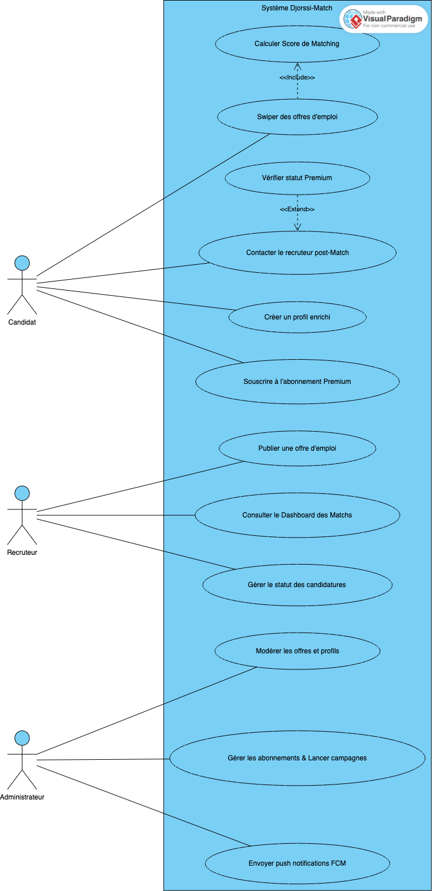

```mermaid
usecaseDiagram
    actor Candidat
    actor Recruteur
    actor Administrateur

    package "Système Djorssi-Match" {
        Candidat --> (Calculer Score de Matching)
        Candidat --> (Swiper des offres d'emploi)
        Candidat --> (Vérifier statut Premium)
        Candidat --> (Contacter le recruteur post-Match)
        Candidat --> (Créer un profil enrichi)
        Candidat --> (Souscrire à l'abonnement Premium)

        Recruteur --> (Publier une offre d'emploi)
        Recruteur --> (Consulter le Dashboard des Matchs)
        Recruteur --> (Contacter le Candidat post-Match)

        Administrateur --> (Modérer les offres et profils)
        Administrateur --> (Gérer les abonnements & Lancer campagnes)
        Administrateur --> (Envoyer push notifications FCM)
    }

    (Swiper des offres d'emploi) ..> (Calculer Score de Matching) : <<include>>
    (Vérifier statut Premium) ..> (Contacter le recruteur post-Match) : <<extends>>
```

#### 3.2.2. Diagramme de séquence : Cycle de vie d'un Match
Ce diagramme détaille la chorégraphie temporelle d'une action critique : le "Swipe" qui aboutit à une candidature (Match) et une postulation automatique.

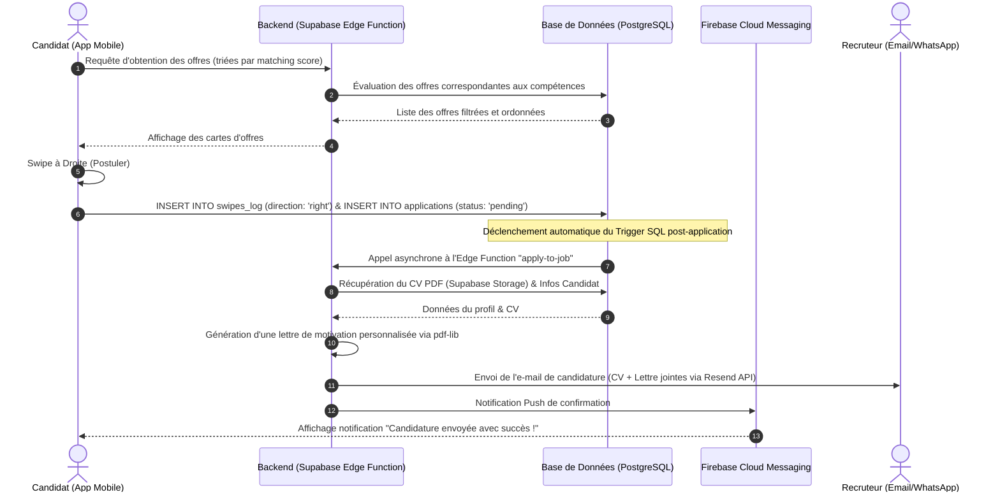

#### 3.2.3. Diagramme de classes du système
Le diagramme de classes représente le modèle de données interne du système Djorssi-Match et illustre les relations logiques fondamentales entre nos entités PostgreSQL.

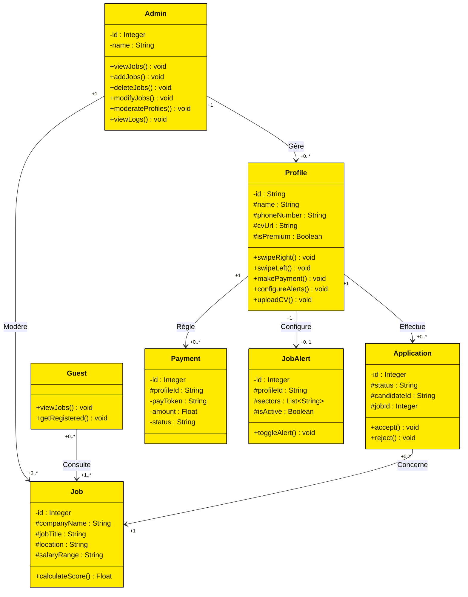

#### 3.2.4. Diagramme d'états-transitions : États d'une candidature
Lorsqu'une candidature (application) est créée suite à un Swipe, elle traverse plusieurs états au cours de son cycle de vie.

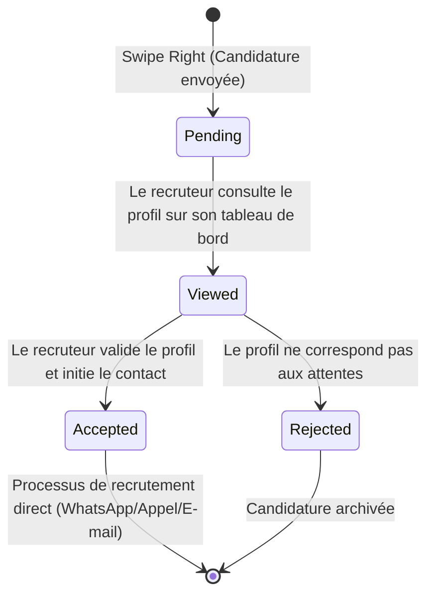

### 3.3. Conception de la base de données (PostgreSQL)
Le choix de PostgreSQL n'est pas anodin. C'est l'un des Systèmes de Gestion de Bases de Données Relationnelles (SGBDR) les plus puissants, offrant le support des types de données complexes essentiels à notre algorithme.

#### 3.3.1. Description logique et structurelle des tables
La structure relationnelle de la base de données est définie par plusieurs migrations SQL ordonnées. Le schéma est articulé autour des tables physiques suivantes :
1. **`profiles` (Candidats) :** Liée directement à la table système d'authentification de Supabase (`auth.users`). Elle contient toutes les informations biographiques du candidat, son statut Premium (`is_premium`, `premium_until`), ses compétences et son jeton d'appareil FCM pour les notifications.
2. **`jobs` (Offres d'emploi) :** Stocke les informations complètes sur les postes vacants, y compris les tags normalisés, le niveau requis, l'expérience, le salaire et les informations de contact (e-mail, WhatsApp, lien externe).
3. **`applications` (Candidatures) :** Table d'association modélisant le match et la postulation du candidat sur une offre, avec un état initialisé à `pending`. Elle résout la relation Many-to-Many entre `profiles` et `jobs` de façon unique via la contrainte `UNIQUE(candidate_id, job_id)`.
4. **`swipes_log` (Historique des balayages) :** Consigne chaque swipe (direction `left` ou `right`) afin d'éviter qu'une offre ne soit présentée plusieurs fois au même candidat et d'assurer le contrôle des quotas quotidiens de swipes.
5. **`payments` (Paiements d'abonnements) :** Gère le suivi transactionnel lié aux souscriptions premium et aux achats in-app via les passerelles mobiles locales.
6. **`user_cvs` (CV générés in-app) :** Stocke les Curriculum Vitae créés interactivement par les utilisateurs (titre du CV, données complètes structurées au format `JSONB`, couleurs graphiques, et identifiant du template sélectionné).
7. **`app_config` (Configuration globale et tarification) :** Table de configuration dynamique (ligne unique `ID=1`) stockant la limite quotidienne de swipes gratuits, le message d'alerte, les prix du Premium (`premium_price_cfa`) et des CV supplémentaires (`extra_cv_price_cfa`), ainsi que les paramètres d'essai gratuit pour le générateur de CV.
8. **`job_alerts` (Abonnements aux alertes) :** Gère les préférences d'alertes d'emploi des candidats par secteurs d'activité, utilisées pour cibler les notifications.
9. **`feedbacks` & `unsubscriptions` :** Consignent les retours qualitatifs généraux, les notes (ratings) et les motifs de désabonnement des utilisateurs.
10. **`delete_account_feedback` :** Stocke de façon anonyme et persistante (même après suppression du compte) les raisons pour lesquelles un utilisateur a supprimé son compte, à des fins d'analyse de rétention.
11. **`support_messages` :** Gère la messagerie du support in-app entre les candidats et les administrateurs.

#### 3.3.2. Utilisation de types avancés : JSONB et Arrays
Pour éviter la prolifération de tables de jointure (qui ralentissent les requêtes de matching), nous exploitons la flexibilité de PostgreSQL :
- **Tableau (`TEXT[]`) :** Les compétences du candidat sont stockées directement sous forme de tableau de textes (`skills TEXT[]`). De même, les tags d'une offre d'emploi sont stockés via `tags TEXT[]`. La comparaison s'effectue en mémoire très rapidement via des opérateurs de chevauchement d'arrays.
- **Format JSONB :** La table `jobs` contient un champ `raw_data JSONB`. Ce champ permet au Scraper Python de sauvegarder l'intégralité du code HTML brut ou des métadonnées variables (sans schéma rigide) extraites du site source, afin de les traiter ultérieurement par l'Intelligence Artificielle sans casser le schéma SQL.

### 3.4. Le Moteur de Matching
L'innovation centrale de Djorssi-Match repose sur son algorithme de calcul du score de compatibilité (Matching Score). Contrairement à une simple recherche par mots-clés, le système attribue des points selon la pertinence des compétences du candidat par rapport aux besoins réels de l'offre.

#### 3.4.1. Fonctionnement de l'algorithme
Pour être extrêmement simple à comprendre et à défendre, le calcul du score de compatibilité se résume à une soustraction évidente :

**Score Final = Points Gagnés - Points Perdus**

Voici le schéma visuel de la décision prise par l'algorithme pour chaque offre d'emploi analysée :

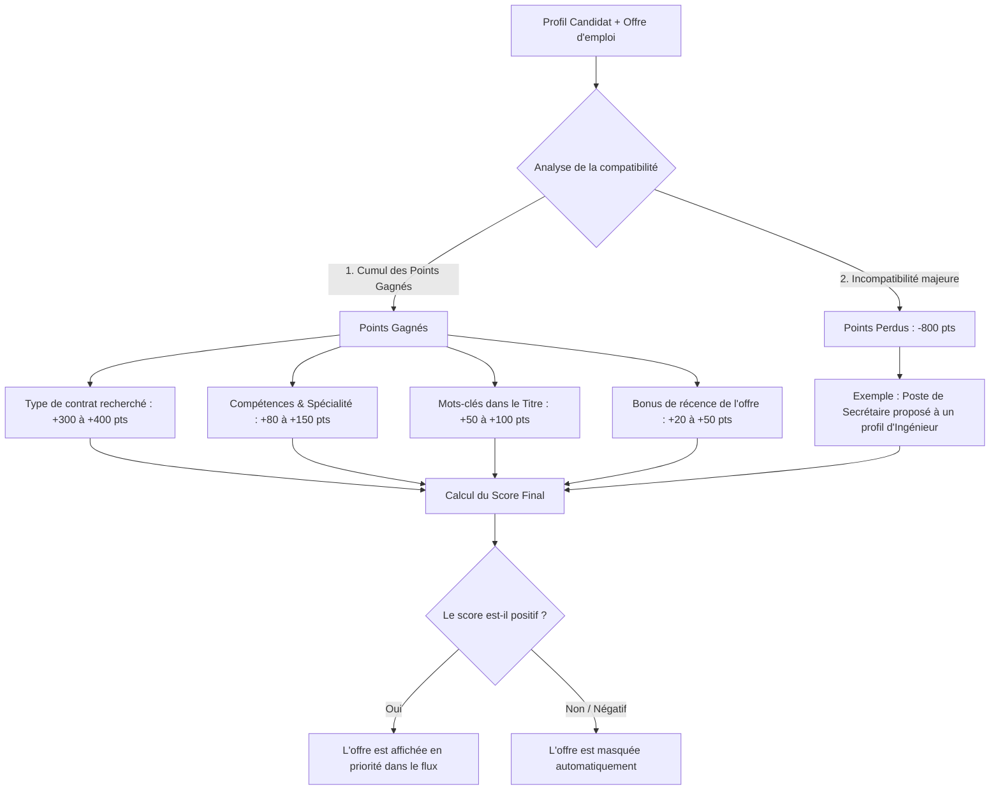

##### Explication des règles de calcul :

1. **Les Points Gagnés (Les Bonus) :**
   * **Le Contrat (+300 à +400 pts) :** Si le candidat recherche un type de contrat précis (ex: CDI) et que l'offre correspond, il obtient ses premiers points.
   * **Les Compétences (+80 à +150 pts) :** Plus les compétences du candidat correspondent aux besoins de l'offre, plus il gagne de points.
   * **Le Titre du poste (+50 à +100 pts) :** Des points bonus s'ajoutent si les compétences recherchées apparaissent directement dans le titre de l'offre d'emploi.
   * **La Récence (+20 à +50 pts) :** Un bonus récompense les offres très récentes (publiées depuis moins de 24h ou 72h).

2. **Les Points Perdus (La Pénalité de -800 pts) :**
   * **Le problème classique :** Sur les autres sites, si un ingénieur en informatique cherche du travail, le système va lui proposer des postes de **secrétaire** car l'offre de secrétaire mentionne *"maîtrise de l'outil informatique"*. C'est une erreur inutile.
   * **Notre solution :** Si l'algorithme détecte que le titre de l'offre ("Secrétaire") n'a aucun rapport avec le profil réel du candidat ("Ingénieur"), il retire immédiatement **800 points** (points perdus). Le score devient négatif et l'offre est masquée pour ne pas déranger le candidat.

#### 3.4.2. Logique des filtres dynamiques
Au-delà des compétences, le score global peut être ajusté par des filtres logiques dits "Hard Filters" (Filtres stricts) ou "Soft Filters" (Filtres souples) :
- **Localisation (Hard Filter) :** Si l'offre est à Abidjan et que le candidat a précisé qu'il ne cherche qu'à Bouaké, le score est forcé à zéro (ou masqué).
- **Salaire (Soft Filter) :** Si les prétentions salariales du candidat sont légèrement supérieures à la fourchette de l'offre, le système n'élimine pas l'offre mais réduit le score final de 10%, permettant au candidat de décider lui-même en dernier recours.

Ce modèle algorithmique hybride, mêlant heuristiques strictes et pondérations contextuelles, constitue le cœur de la plateforme, garantissant au candidat de ne swiper que sur des offres hautement qualifiées.

---

## CHAPITRE IV : ÉCOSYSTÈME TECHNOLOGIQUE ET DÉVELOPPEMENT

La réussite d'un projet de l'envergure de Djorssi-Match repose sur le choix judicieux, la maîtrise et l'intégration d'un écosystème technologique moderne. Ce chapitre propose une description théorique et structurelle exhaustive de chaque composant matériel et logiciel mis en œuvre pour concrétiser notre plateforme de recrutement prédictive.

---

### 4.1. Le Frontend Mobile : Flutter & Dart

<div style="text-align: center; margin: 30px 0;">
    
    <p style="font-size: 0.9em; color: #666; font-style: italic;">Figure 4.1 : Framework Flutter et Langage Dart</p>
</div>

#### 4.1.1. Définition et Architecture de Flutter
Flutter est un framework de développement d'interfaces utilisateur open-source créé par Google en 2017. Contrairement aux approches hybrides traditionnelles (comme Apache Cordova) qui encapsulent du code web dans un composant WebView, ou aux approches semi-natives (comme React Native) qui servent de pont JavaScript vers les widgets natifs de l'OS, Flutter adopte une approche de rendu direct.

Le moteur interne de Flutter, développé à l'origine en C++ (moteur de rendu **Impeller** sur iOS et progressivement sur Android), dessine chaque pixel, bouton, texte et forme directement sur un canevas graphique de l'appareil (via Skia ou Vulkan/Metal). Cela élimine totalement les ponts de communication coûteux entre le code applicatif et les composants natifs, garantissant des animations fluides et constantes à 60 ou 120 images par seconde (fps).

Dans Djorssi-Match, l'adoption de Flutter garantit que l'expérience du "Swipe", qui repose sur des mouvements physiques fluides de cartes, est extrêmement réactive, sans aucun micro-ralentissement, y compris sur des appareils d'entrée ou de milieu de gamme très courants en Côte d'Ivoire.

#### 4.1.2. Le Langage Dart et le Modèle Asynchrone
Flutter utilise le langage **Dart**, également développé par Google. Dart est un langage fortement typé, orienté objet, optimisé pour la création d'interfaces utilisateur réactives. Il dispose de deux modes de compilation complémentaires :
- **Just-In-Time (JIT) :** Utilisé en phase de développement pour permettre le *Hot Reload* (rechargement à chaud instantané du code sans perte d'état de l'application), ce qui décuple la productivité du développeur.
- **Ahead-Of-Time (AOT) :** Utilisé lors de la compilation finale de production. Le code Dart est compilé directement en code machine natif ARM ou x86, ce qui permet des lancements ultra-rapides et des performances brutes comparables au Java/Kotlin ou Swift natif.

**Le modèle asynchrone de Dart (Event Loop, Futures et Streams) :**
Dart s'exécute sur un seul thread d'exécution par instance (appelée un *Isolate*). Pour éviter de bloquer l'interface utilisateur lors d'opérations lourdes (comme le chargement d'un fichier CV ou le calcul du matching d'offres depuis un cache local), Dart utilise une "Boucle d'Événements" (Event Loop). 
- Les **`Future`** représentent le résultat d'une opération asynchrone qui se terminera ultérieurement (ex. récupérer une réponse HTTP).
- Les **`Stream`** représentent - **La couche Domain (Domaine) :** C'est le cœur de la logique métier. Elle est totalement indépendante des frameworks, bases de données ou de l'interface utilisateur. Elle contient les entités métiers (Entities) et les cas d'utilisation (Use Cases) qui décrivent les règles fonctionnelles de Djorssi-Match (comme la logique d'acceptation d'un match ou d'activation d'un abonnement).
- **La couche Presentation (Présentation) :** C'est la couche d'interface utilisateur (UI). Dans Flutter, elle est composée de Widgets (boutons, formulaires, cartes de swipe) et de gestionnaires d'état légers (comme Provider ou BLoC) qui reçoivent les interactions utilisateurs, appellent les Use Cases du domaine, et mettent à jour l'écran de manière réactive.

<div class="page-break"></div>
<div style="display: flex; flex-direction: column; align-items: center; justify-content: center; padding: 30px 0; margin: 30px auto; max-width: 650px;">
    <div style="text-align: center; width: 100%; border: 1px solid #e2e8f0; border-radius: 16px; padding: 35px; background: #fff; box-shadow: 0 4px 20px rgba(0,0,0,0.06); page-break-inside: avoid;">
        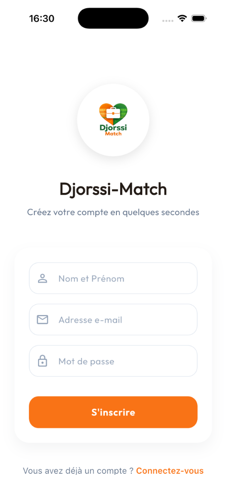
        <h5 style="margin-top: 25px; margin-bottom: 8px; font-weight: 700; font-size: 1.15em; color: var(--color-primary); font-family: var(--font-sans);">Figure 4.2 : Écran de Création de Compte</h5>
        <p style="font-size: 1em; color: #444; text-align: justify; margin: 0 15px; text-indent: 0; line-height: 1.6; font-family: var(--font-serif);">Cet écran épuré permet au candidat de s'inscrire en quelques secondes en entrant son nom, e-mail et mot de passe. Il illustre l'approche ergonomique et minimaliste de l'application, réduisant le taux d'abandon au démarrage.</p>
    </div>
</div>

<div class="page-break"></div>
<div style="display: flex; flex-direction: column; align-items: center; justify-content: center; padding: 30px 0; margin: 30px auto; max-width: 650px;">
    <div style="text-align: center; width: 100%; border: 1px solid #e2e8f0; border-radius: 16px; padding: 35px; background: #fff; box-shadow: 0 4px 20px rgba(0,0,0,0.06); page-break-inside: avoid;">
        
        <h5 style="margin-top: 25px; margin-bottom: 8px; font-weight: 700; font-size: 1.15em; color: var(--color-primary); font-family: var(--font-sans);">Figure 4.3 : Écran de Vérification de Sécurité (OTP)</h5>
        <p style="font-size: 1em; color: #444; text-align: justify; margin: 0 15px; text-indent: 0; line-height: 1.6; font-family: var(--font-serif);">L'interface de saisie du code de confirmation envoyé par e-mail. Elle intègre un compte à rebours dynamique pour la réexpédition du code, garantissant la validation sécurisée de chaque compte utilisateur avant accès.</p>
    </div>
</div>

<div class="page-break"></div>
<div style="display: flex; flex-direction: column; align-items: center; justify-content: center; padding: 30px 0; margin: 30px auto; max-width: 650px;">
    <div style="text-align: center; width: 100%; border: 1px solid #e2e8f0; border-radius: 16px; padding: 35px; background: #fff; box-shadow: 0 4px 20px rgba(0,0,0,0.06); page-break-inside: avoid;">
        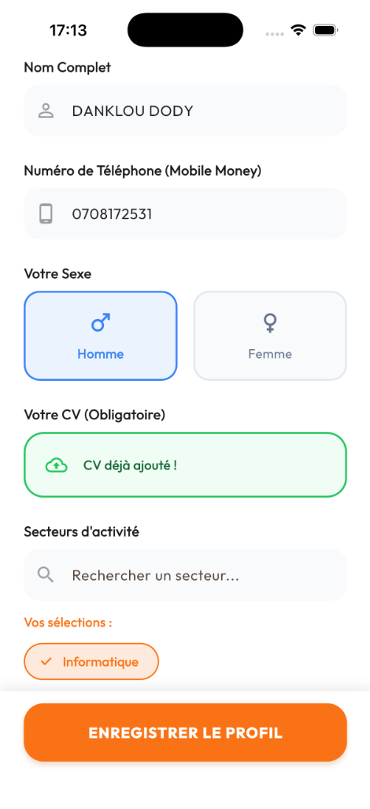
        <h5 style="margin-top: 25px; margin-bottom: 8px; font-weight: 700; font-size: 1.15em; color: var(--color-primary); font-family: var(--font-sans);">Figure 4.4 : Écran de Renseignement du Profil</h5>
        <p style="font-size: 1em; color: #444; text-align: justify; margin: 0 15px; text-indent: 0; line-height: 1.6; font-family: var(--font-serif);">L'interface complète de saisie du profil. Le candidat y indique son nom, numéro de téléphone Mobile Money, son sexe, téléverse son CV obligatoire (détecté par notre système) et sélectionne ses secteurs d'activité cibles.</p>
    </div>
</div>

<div class="page-break"></div>
<div style="display: flex; flex-direction: column; align-items: center; justify-content: center; padding: 30px 0; margin: 30px auto; max-width: 650px;">
    <div style="text-align: center; width: 100%; border: 1px solid #e2e8f0; border-radius: 16px; padding: 35px; background: #fff; box-shadow: 0 4px 20px rgba(0,0,0,0.06); page-break-inside: avoid;">
        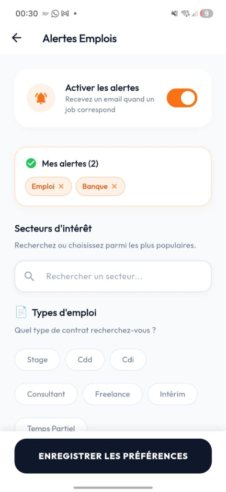
        <h5 style="margin-top: 25px; margin-bottom: 8px; font-weight: 700; font-size: 1.15em; color: var(--color-primary); font-family: var(--font-sans);">Figure 4.5 : Écran des Alertes d'Emplois</h5>
        <p style="font-size: 1em; color: #444; text-align: justify; margin: 0 15px; text-indent: 0; line-height: 1.6; font-family: var(--font-serif);">Cet écran permet au candidat de configurer ses alertes personnalisées pour recevoir des e-mails automatiques lorsque des offres d'emploi correspondent à ses préférences. Il choisit ici ses secteurs d'intérêt et ses types d'emplois préférés (Stage, CDD, CDI, etc.).</p>
    </div>
</div>

<div class="page-break"></div>
<div style="display: flex; flex-direction: column; align-items: center; justify-content: center; padding: 30px 0; margin: 30px auto; max-width: 650px;">
    <div style="text-align: center; width: 100%; border: 1px solid #e2e8f0; border-radius: 16px; padding: 35px; background: #fff; box-shadow: 0 4px 20px rgba(0,0,0,0.06); page-break-inside: avoid;">
        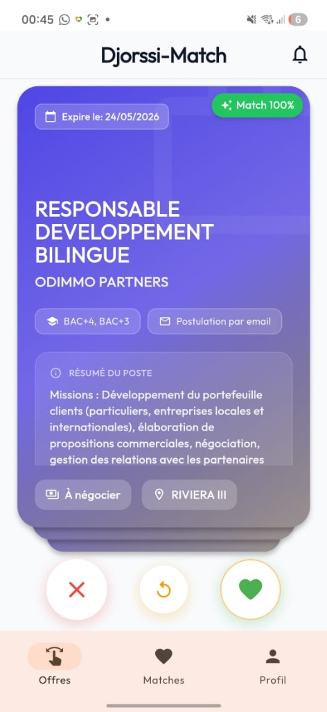
        <h5 style="margin-top: 25px; margin-bottom: 8px; font-weight: 700; font-size: 1.15em; color: var(--color-primary); font-family: var(--font-sans);">Figure 4.6 : Écran de Swipe et de Matching</h5>
        <p style="font-size: 1em; color: #444; text-align: justify; margin: 0 15px; text-indent: 0; line-height: 1.6; font-family: var(--font-serif);">L'interface de Swipe. L'offre active (« Responsable Développement Bilingue ») s'affiche sous forme de carte interactive avec un score de compatibilité « Match 100% » généré en temps réel par notre algorithme de matching.</p>
    </div>
</div>

<div class="page-break"></div>
<div style="display: flex; flex-direction: column; align-items: center; justify-content: center; padding: 30px 0; margin: 30px auto; max-width: 650px;">
    <div style="text-align: center; width: 100%; border: 1px solid #e2e8f0; border-radius: 16px; padding: 35px; background: #fff; box-shadow: 0 4px 20px rgba(0,0,0,0.06); page-break-inside: avoid;">
        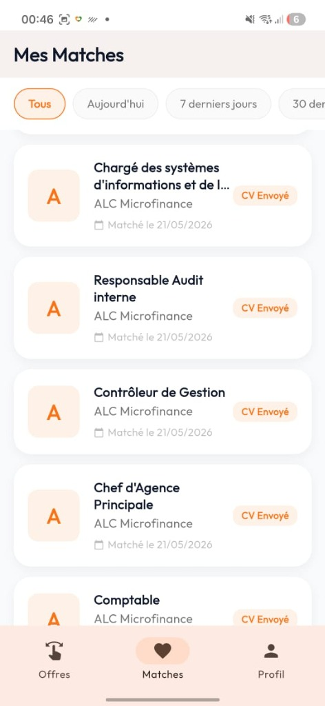
        <h5 style="margin-top: 25px; margin-bottom: 8px; font-weight: 700; font-size: 1.15em; color: var(--color-primary); font-family: var(--font-sans);">Figure 4.7 : Écran de Suivi des Matches</h5>
        <p style="font-size: 1em; color: #444; text-align: justify; margin: 0 15px; text-indent: 0; line-height: 1.6; font-family: var(--font-serif);">Cette interface regroupe tous les matches du candidat, montrant l'état de chaque candidature (« CV Envoyé ») en mode Premium activé, débloquant l'historique et permettant un suivi complet sans restriction.</p>
    </div>
</div>

<div class="page-break"></div>
<div style="display: flex; flex-direction: column; align-items: center; justify-content: center; padding: 30px 0; margin: 30px auto; max-width: 650px;">
    <div style="text-align: center; width: 100%; border: 1px solid #e2e8f0; border-radius: 16px; padding: 35px; background: #fff; box-shadow: 0 4px 20px rgba(0,0,0,0.06); page-break-inside: avoid;">
        
        <h5 style="margin-top: 25px; margin-bottom: 8px; font-weight: 700; font-size: 1.15em; color: var(--color-primary); font-family: var(--font-sans);">Figure 4.8 : Écran de l'Offre Premium</h5>
        <p style="font-size: 1em; color: #444; text-align: justify; margin: 0 15px; text-indent: 0; line-height: 1.6; font-family: var(--font-serif);">L'interface d'achat Premium détaillant les avantages exclusifs : swipes illimités, historique déverrouillé et badge candidat certifié pour maximiser la visibilité auprès des recruteurs.</p>
    </div>
</div>

<div class="page-break"></div>
<div style="display: flex; flex-direction: column; align-items: center; justify-content: center; padding: 30px 0; margin: 30px auto; max-width: 650px;">
    <div style="text-align: center; width: 100%; border: 1px solid #e2e8f0; border-radius: 16px; padding: 35px; background: #fff; box-shadow: 0 4px 20px rgba(0,0,0,0.06); page-break-inside: avoid;">
        
        <h5 style="margin-top: 25px; margin-bottom: 8px; font-weight: 700; font-size: 1.15em; color: var(--color-primary); font-family: var(--font-sans);">Figure 4.9 : Écran du Profil VIP Premium Activé</h5>
        <p style="font-size: 1em; color: #444; text-align: justify; margin: 0 15px; text-indent: 0; line-height: 1.6; font-family: var(--font-serif);">L'écran de bord de profil personnel du candidat après achat de la formule Premium. Il affiche le badge « MEMBRE VIP » doré, le bandeau de confirmation des avantages activés, les secteurs ciblés et le statut de téléversement du CV.</p>
    </div>
</div>

---

### 4.2. Le Backend Serverless : Supabase & PostgreSQL

<div style="display: flex; justify-content: center; align-items: center; gap: 40px; margin: 30px 0; page-break-inside: avoid;">
    
    <div style="width: 2px; height: 50px; background-color: #e2e8f0;"></div>
    
</div>

#### 4.2.1. Supabase : L'Alternative Serverless Open-Source
Supabase est une suite d'outils backend open-source qui propose une alternative robuste et sécurisée à Google Firebase (Supabase Documentation 2026). Plutôt que d'imposer une base de données NoSQL propriétaire (comme Firestore), Supabase est entièrement bâti sur **PostgreSQL**, une base de données relationnelle standardisée et puissante.

Supabase regroupe plusieurs services essentiels en un seul écosystème Serverless :
- **Supabase Database :** Une instance PostgreSQL managée avec accès direct à toutes ses fonctionnalités.
- **Supabase Auth :** Un service d'authentification complet et sécurisé prenant en charge l'e-mail/mot de passe, les codes OTP, ainsi que les fournisseurs sociaux (Google, Facebook).
- **Supabase Storage :** Un service de stockage d'objets pour héberger des fichiers (avatars, CV), entièrement contrôlé par les politiques de la base de données.
- **Supabase Edge Functions :** Un environnement d'exécution asynchrone pour exécuter des scripts métier déportés.

Dans Djorssi-Match, l'utilisation de Supabase permet de s'affranchir de toute la maintenance système (mises à jour d'OS, pare-feu, monitoring des processus serveurs). Le backend s'auto-scale de façon élastique selon la demande des utilisateurs.

#### 4.2.2. PostgreSQL et la Sécurité Granulaire RLS
PostgreSQL est l'un des moteurs de bases de données relationnelles les plus avancés au monde. Il supporte les indexations géographiques, sémantiques, et le format de données JSONB extrêmement performant.

La sécurité des données dans Djorssi-Match repose sur les politiques de **Row Level Security (RLS)** de PostgreSQL. Contrairement aux architectures classiques où la sécurité est implémentée dans le code applicatif (API Express, Django, etc.), le RLS permet d'attacher des règles de sécurité directement sur les tables physiques en base de données.
*   Chaque requête client passant par Supabase contient le jeton JWT (JSON Web Token) d'authentification de l'utilisateur.
*   PostgreSQL valide cryptographiquement ce jeton et extrait l'identifiant utilisateur unique (`auth.uid()`).
*   Les politiques RLS limitent alors automatiquement le jeu de résultats retournés. Par exemple, sur la table `profiles`, la règle suivante est déclarée :
    `CREATE POLICY "Candidat ne lit que son profil" ON profiles FOR SELECT USING (auth.uid() = id);`
*   Si un utilisateur malveillant tente d'exécuter une requête réseau pour consulter un profil tiers, PostgreSQL renverra un ensemble vide (ou une erreur 403), offrant une garantie de sécurité absolue, indépendamment des clients frontend.

#### 4.2.3. Deno et les Edge Functions TypeScript
Les Edge Functions de Supabase sont des micro-services écrits en **TypeScript** s'exécutant dans l'environnement **Deno**. Deno est un runtime JavaScript/TypeScript ultra-sécurisé créé par Ryan Dahl (le créateur d'origine de Node.js). 

Contrairement à Node.js, Deno est compilé en Rust et s'exécute par défaut dans un bac à sable (sandbox) totalement hermétique. Il ne possède aucun accès au réseau, au système de fichiers ou à l'environnement, à moins que des permissions explicites ne lui soient accordées au lancement. De plus, Deno télécharge directement les dépendances via des URLs standardisées, éliminant le besoin du gestionnaire de paquet lourd `npm`.

Dans Djorssi-Match, nos Edge Functions TypeScript sont hébergées au plus proche de l'utilisateur géographique (Abidjan/Côte d'Ivoire), minimisant le temps de latence réseau. Elles sont sollicitées pour l'initiation des transactions financières avec l'API GeniusPay (`geniuspay-initiate`), la suppression de compte conforme (`delete-account`), et la gestion automatisée des candidatures via l'Edge Function `apply-to-job`.

---

### 4.3. L'Intelligence Artificielle & Automatisation : Python, Playwright & Ollama

<div style="display: flex; justify-content: center; align-items: center; gap: 30px; margin: 30px 0; flex-wrap: wrap; page-break-inside: avoid;">
    
    <div style="width: 2px; height: 50px; background-color: #e2e8f0;"></div>
    
    <div style="width: 2px; height: 50px; background-color: #e2e8f0;"></div>
    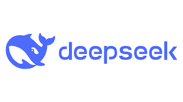
</div>

#### 4.3.1. Le Moteur d'Automatisation Python
Python est le langage de programmation par excellence pour l'analyse de données, le web scraping et l'Intelligence Artificielle. Dans Djorssi-Match, un worker Python autonome s'exécute en continu sur un serveur distant pour alimenter la base de données.

Le scraper utilise un ensemble de crawlers hautement parallélisés qui parcourent les sites d'emploi ivoiriens de référence (Educarriere, Emploi.ci, RMO JobCenter, ProJobIvoire). Grâce aux modules asynchrones de Python (`httpx` et `asyncio`), le worker interroge des dizaines de serveurs sources en simultané, optimisant le débit de données et minimisant le temps d'exécution global.

#### 4.3.2. Playwright Stealth : Contournement des Protections Anti-Bot
Pour extraire les informations des plateformes modernes équipées de pares-feu applicatifs stricts (comme Cloudflare, Akamai) ou qui reposent lourdement sur le rendu JavaScript côté client (Single Page Applications), l'utilisation de requêtes HTTP simples (`requests` ou `httpx`) est inefficace ou bloquée.

Nous utilisons **Playwright**, une bibliothèque d'automatisation de navigateur moderne développée par Microsoft. Playwright lance des instances réelles et légères de navigateurs web (Chromium, Firefox ou WebKit) pour charger les pages, exécuter les scripts JavaScript des sites cibles et restituer le code HTML final.

Pour contourner les mécanismes de détection de robots (anti-bot), Playwright est configuré avec un plugin d'anonymisation avancée appelé **`playwright-stealth`**. Ce module modifie dynamiquement les variables système du navigateur (User-Agent réaliste, comportement des WebGL, masquage de l'objet global `window.navigator.webdriver`), empêchant les serveurs distants de détecter la nature automatisée de la navigation.

#### 4.3.3. Ollama et le modèle local Qwen 2.5 (7b)
Pour structurer et nettoyer les textes d'annonces désorganisés extraits par les crawlers locaux, Djorssi-Match intègre une architecture d'Intelligence Artificielle locale basée sur **Ollama** (Ollama Documentation 2026).

Ollama est un outil open-source performant qui permet de compiler, déployer et exécuter localement des modèles de langage de grande taille (LLMs) sur des infrastructures privées. Plutôt que de dépendre d'APIs cloud payantes (comme OpenAI GPT-4o), qui posent des problèmes majeurs de coûts récurrents et de confidentialité des données, l'utilisation d'Ollama garantit une gratuité totale de traitement après acquisition du serveur.

**Le modèle Qwen 2.5 (7b) :**
Développé par l'équipe Alibaba Cloud, Qwen 2.5 est l'un des modèles de langage ouverts les plus puissants au monde dans sa catégorie de taille (7 milliards de paramètres). Il affiche d'excellentes performances en raisonnement logique et en manipulation de formats structurés.

Le scraper Python envoie le texte brut de l'annonce extraite à Ollama via une requête locale. Le prompt est configuré pour forcer Qwen 2.5 à analyser l'offre et à retourner obligatoirement un schéma JSON valide contenant les champs indispensables à l'algorithme de matching (tags, niveau d'étude, compétences, e-mail ou WhatsApp de contact). Le modèle valide également si le texte correspond bien à une vraie offre d'emploi ou s'il s'agit d'une publicité frauduleuse.

#### 4.3.4. Transparence Académique & Optimisation Industrielle : Le Pivot vers EasyScrap & DeepSeek
Dans le cadre d'un projet de fin d'études et d'une industrialisation réelle, la confrontation avec les contraintes opérationnelles du monde de la production est une étape indispensable. Si le scraper personnalisé développé à l'aide de **Playwright Stealth** et d'un modèle **Qwen 2.5 local via Ollama** fonctionne de manière satisfaisante sur de petits volumes locaux ou des sites de test, il a révélé des limites d'échelle majeures en conditions réelles de production :
1. **La vitesse d'exécution (Lenteur) :** Le chargement de pages entières avec un navigateur automatisé en mode *Headless* (sans tête) combiné au traitement local d'un LLM de 7 milliards de paramètres sur un serveur CPU standard est extrêmement lent et gourmand en ressources matérielles.
2. **La robustesse face aux anti-bots stricts :** Des plateformes d'envergure comme **LinkedIn** et **Facebook** modifient continuellement leurs algorithmes de protection anti-scraping (signatures Canvas, analyses comportementales stricts de Cloudflare), rendant le maintien à jour de scripts Playwright manuels complexe et chronophage.

Afin de pallier ces limites, de garantir la continuité du service et de maximiser la vitesse d'ingestion des offres d'emploi, nous avons opéré un pivot d'architecture pragmatique et transparent pour la phase de production en intégrant l'outil professionnel **EasyScrap** (`easy-scrap`).

##### Le Processus d'Ingestion Hybride en Production : EasyScrap + DeepSeek
En production, le flux d'ingestion s'appuie désormais sur une architecture hybride hautement performante :
* **Extraction des Données Brutes (Scraping) :** Grâce à l'extension et aux outils de scraping de **EasyScrap**, l'extraction des données textuelles depuis LinkedIn, Facebook et d'autres plateformes d'annonces se fait instantanément, sans risque de blocage ou de captcha, et de manière fluide.
* **Structuration Intelligente via DeepSeek :** Le texte brut récupéré par EasyScrap est immédiatement soumis à l'API du modèle de pointe **DeepSeek** via un prompt d'extraction de données RH ultra-ciblé. DeepSeek analyse le texte libre de l'annonce et génère en retour un tableau JSON parfaitement structuré et valide, débarrassé de tout bruit ou formatage markdown superflu.
* **Ingestion de Masse et Gestion des Doublons (Deduplication) :** Ces données JSON nettoyées sont ensuite injectées en masse (*bulk insert*) dans notre base de données PostgreSQL via Supabase. Pour garantir l'intégrité des données, nous avons mis en place une fonction d'insertion avec gestion stricte des conflits (*UPSERT*). Si une annonce avec le même titre, la même entreprise et le même lieu existe déjà, elle est ignorée ou mise à jour, évitant ainsi les doublons polluants pour l'expérience utilisateur du candidat.
* **Console d'Administration :** L'administrateur valide d'un coup d'œil ces offres ingérées depuis son tableau de bord React.

##### Le Prompt de Structuration RH (DeepSeek)
Voici le prompt exact et optimisé envoyé à DeepSeek pour transformer toute annonce brute en objet JSON standardisé :

```markdown
Agis comme un expert en extraction de données RH. Je vais te donner des annonces d'emploi. Tu devez analyser le texte pour en extraire les informations et me retourner UNIQUEMENT un tableau JSON valide (sans aucun texte avant ou après, ni formatage markdown autour du JSON).

Instructions pour chaque paramètre à extraire :

- title : Extrait le titre exact du poste proposé.
- company_name : Extrait le nom de l'entreprise qui recrute. Si c'est confidentiel ou non mentionné, mets null.
- lieu : Extrait la ville ou la zone géographique (ex: "Abidjan", "San Pedro"). Si non mentionné, mets null.
- niveau : Extrait le niveau d'études ou le diplôme requis (ex: "BAC+2", "Master"). Si non mentionné, mets null.
- deadline : Trouve la date limite de candidature et convertis-la TOUJOURS au format JJ/MM/AAAA. Si aucune date n'est trouvée, mets null.
- summary : Rédige un résumé clair, professionnel et structuré regroupant les "Missions principales" et le "Profil recherché".
- tags : Crée un tableau de 5 à 10 mots-clés très pertinents (compétences techniques, secteur, outils). Ex: ["Comptabilité", "Excel", "Finance"].
- email : Extrait l'adresse e-mail de contact pour postuler. Si absente, mets null.
- contact : Extrait le numéro de téléphone ou WhatsApp mentionné pour le contact ou la candidature. Ne garde que les chiffres/espaces. Si absent, mets null.
- lettre_motivation : Si le texte exige explicitement une lettre de motivation, écris la chaîne de caractères "OUI". S'il n'y a aucune mention de lettre de motivation, mets null.
- objet : S'il y a une consigne spécifique pour l'objet du mail (ex: "Mettre en objet : Candidature Commercial"), extrais-la ici. Sinon, mets null.
- urls : Si un lien URL source est présent dans le texte pour postuler ou voir l'offre originale, extrais-le. Sinon, mets null. (Attention : Ne confondez pas avec des URLs d'exemples de sites génériques. Le paramètre urls sert spécifiquement pour les annonces qui ne fournissent ni e-mail ni numéro de téléphone mais exigent de postuler via un lien web dédié ou un portail tiers de recrutement. Vérifiez scrupuleusement cet aspect).
- salary_range : Extrait les informations sur le salaire (ex: "300 000 FCFA", "Selon grille salariale", "À négocier"). Si non mentionné, mets null.

Règle d'or : Pour toute valeur introuvable, utilise la valeur JSON null (sans guillemets).

Structure JSON exacte à respecter :
[
  {
    "title": "",
    "company_name": "",
    "lieu": "",
    "niveau": "",
    "deadline": "",
    "summary": "",
    "tags": [],
    "email": "",
    "contact": "",
    "lettre_motivation": "",
    "objet": "",
    "urls": "",
    "salary_range": ""
  }
]
```

##### Exemple de Résultat Obtenu en Production (Format JSON)
Pour une annonce brute concernant un poste de stagiaire commercial chez TRABSOU GROUP, le moteur retourne l'objet JSON standardisé suivant, prêt à l'insertion en base de données :

```json
[
  {
    "title": "STAGIAIRE COMMERCIAL POUR UN STAGE DE VALIDATION",
    "company_name": "TRABSOU GROUP",
    "lieu": "ABIDJAN-YOPOUGON",
    "niveau": "BAC+2",
    "deadline": "12/05/2026",
    "summary": "Stage de validation Commercial(e). Missions : participer à la réalisation de la prospection digitale, au développement et à la fidélisation du portefeuille client, participer au développement du chiffre d'affaires, veiller au traitement des commandes, participer aux activités et actions de communication, veiller à la satisfaction des clients. Profil : Bac+2 Gestion commerciale, bonne connaissance des techniques commerciales, capacité rédactionnelle et de communication, capacité de négociation, organisé(e), écoute active, maîtrise des outils bureautiques et digitaux.",
    "tags": ["Commercial", "Stage", "Validation", "Prospection", "Digital"],
    "email": "recrutement@trabsou.com",
    "contact": null,
    "lettre_motivation": "OUI",
    "objet": "Stage de validation-Gestion commerciale",
    "urls": null,
    "salary_range": null
  }
]
```

##### Modélisation Complète des Tunnels d'Ingestion
Le diagramme suivant présente l'architecture globale des deux pipelines d'acquisition de Djorssi-Match : le pipeline d'ingestion standardisé via notre solution locale (Playwright + Ollama) et le pipeline d'ingestion industrielle à forte résilience (EasyScrap + DeepSeek).

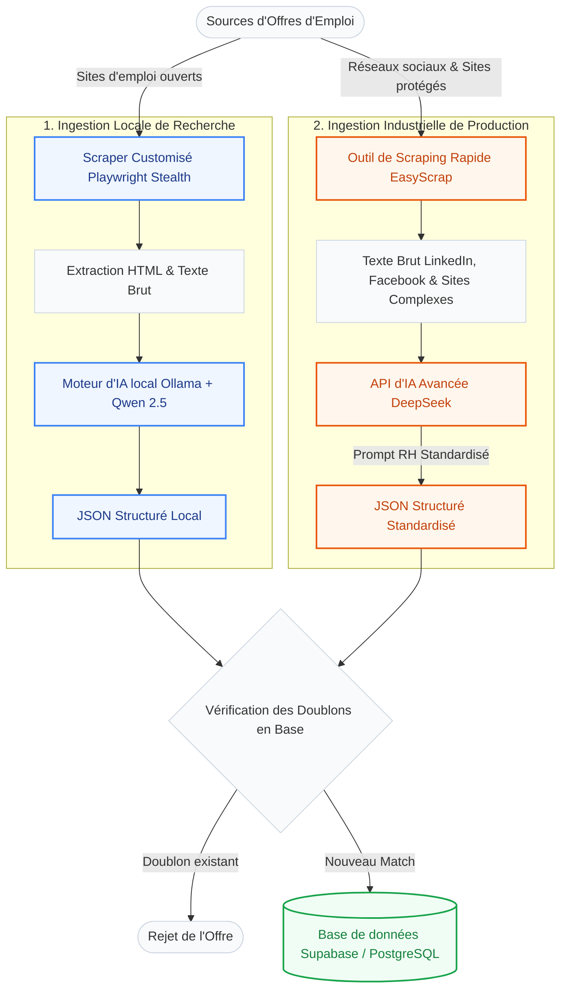

---

### 4.4. Le Frontend Web & Dashboard : React, Vite & Tailwind CSS

<div style="text-align: center; margin: 30px 0; page-break-inside: avoid;">
    
</div>

#### 4.4.1. React et le Bundler Vite
Pour la console d'administration et de modération destinée aux équipes opérationnelles, nous avons développé une application Web réactive avec **React**. React est une bibliothèque JavaScript open-source créée par Facebook, qui repose sur le concept de composants réutilisables et le rafraîchissement performant du DOM virtuel (Virtual DOM).

L'application est propulsée par **Vite**, un outil de développement frontend de nouvelle génération qui remplace le classique Webpack. Vite exploite les modules ES natifs du navigateur pour offrir des lancements de serveurs de développement quasi-instantanés et utilise **Esbuild** (un compilateur écrit en Go) pour compiler et minifier le code de production à une vitesse record.

#### 4.4.2. Styling Expressif avec Tailwind CSS
Pour l'aspect graphique du Dashboard Web B2B, nous exploitons **Tailwind CSS**. Tailwind est un framework CSS utilitaire qui propose des classes CSS pré-configurées de bas niveau (ex. `flex`, `pt-4`, `text-blue-500`, `rounded-lg`). 

Contrairement aux frameworks de composants lourds (comme Bootstrap ou Semantic UI) qui imposent des styles prédéfinis difficiles à personnaliser, Tailwind permet de concevoir rapidement des interfaces modernes et harmonieuses directement dans les fichiers HTML ou JSX sans avoir à rédiger de longues feuilles de style CSS distinctes, optimisant le poids du bundle de production final.

<div class="page-break"></div>
<div style="display: flex; flex-direction: column; align-items: center; justify-content: center; padding: 30px 0; margin: 30px auto; max-width: 800px;">
    <div style="text-align: center; width: 100%; border: 1px solid #e2e8f0; border-radius: 16px; padding: 35px; background: #fff; box-shadow: 0 4px 20px rgba(0,0,0,0.06); page-break-inside: avoid;">
        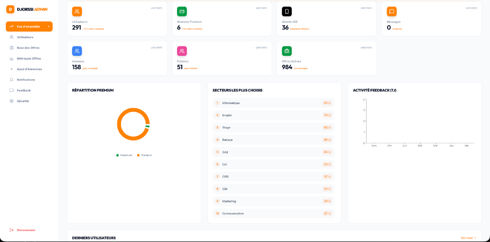
        <h5 style="margin-top: 25px; margin-bottom: 8px; font-weight: 700; font-size: 1.15em; color: var(--color-primary); font-family: var(--font-sans);">Figure 4.10 : Dashboard React - Vue d'Ensemble des Statistiques</h5>
        <p style="font-size: 1em; color: #444; text-align: justify; margin: 0 15px; text-indent: 0; line-height: 1.6; font-family: var(--font-serif);">L'écran d'accueil du Dashboard Web de modération et d'administration. Il présente des indicateurs de synthèse en temps réel (nombre d'inscrits, abonnés Premium, offres actives, etc.), la répartition des formules Premium sous forme de graphique circulaire, ainsi que le classement des secteurs les plus choisis.</p>
    </div>
</div>

<div class="page-break"></div>
<div style="display: flex; flex-direction: column; align-items: center; justify-content: center; padding: 30px 0; margin: 30px auto; max-width: 800px;">
    <div style="text-align: center; width: 100%; border: 1px solid #e2e8f0; border-radius: 16px; padding: 35px; background: #fff; box-shadow: 0 4px 20px rgba(0,0,0,0.06); page-break-inside: avoid;">
        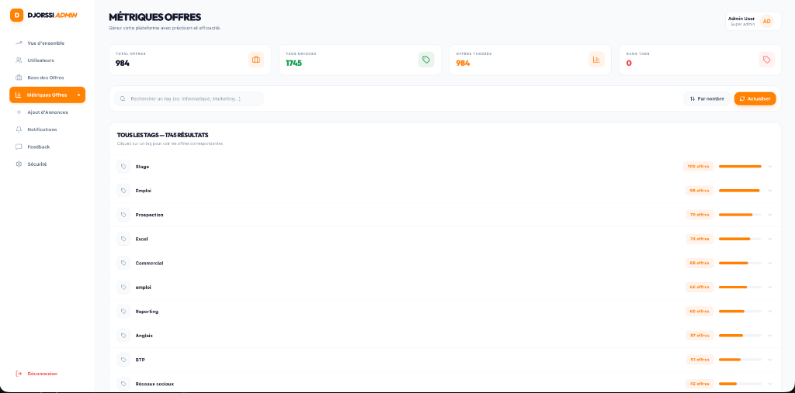
        <h5 style="margin-top: 25px; margin-bottom: 8px; font-weight: 700; font-size: 1.15em; color: var(--color-primary); font-family: var(--font-sans);">Figure 4.11 : Dashboard React - Métriques et Statistiques des Offres</h5>
        <p style="font-size: 1em; color: #444; text-align: justify; margin: 0 15px; text-indent: 0; line-height: 1.6; font-family: var(--font-serif);">L'interface d'analyse statistique des mots-clés et tags d'emploi extraits. Ce tableau de bord permet de comptabiliser précisément le nombre d'offres par étiquette sémantique et de mesurer l'abondance des offres disponibles par compétence ou par poste.</p>
    </div>
</div>

<div class="page-break"></div>
<div style="display: flex; flex-direction: column; align-items: center; justify-content: center; padding: 30px 0; margin: 30px auto; max-width: 800px;">
    <div style="text-align: center; width: 100%; border: 1px solid #e2e8f0; border-radius: 16px; padding: 35px; background: #fff; box-shadow: 0 4px 20px rgba(0,0,0,0.06); page-break-inside: avoid;">
        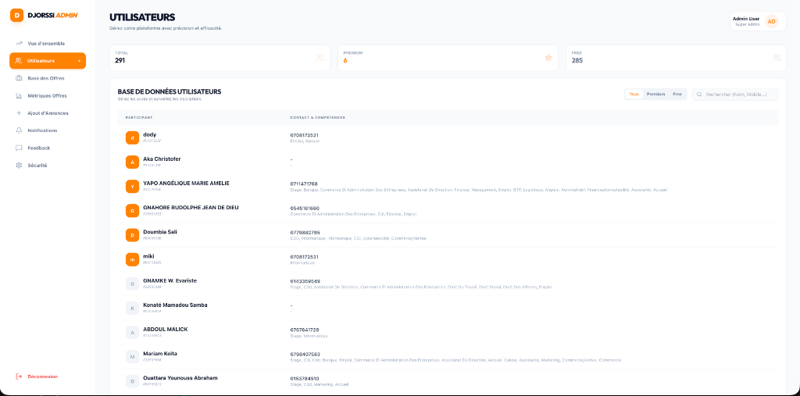
        <h5 style="margin-top: 25px; margin-bottom: 8px; font-weight: 700; font-size: 1.15em; color: var(--color-primary); font-family: var(--font-sans);">Figure 4.12 : Dashboard React - Console de Gestion des Utilisateurs</h5>
        <p style="font-size: 1em; color: #444; text-align: justify; margin: 0 15px; text-indent: 0; line-height: 1.6; font-family: var(--font-serif);">Cet écran permet d'auditer et de superviser la base de données des candidats inscrits sur l'application mobile. Il liste les informations de contact à 10 chiffres, le statut de leur formule (Premium/Free) et donne un accès direct aux compétences déclarées pour chaque profil.</p>
    </div>
</div>

<div class="page-break"></div>
<div style="display: flex; flex-direction: column; align-items: center; justify-content: center; padding: 30px 0; margin: 30px auto; max-width: 800px;">
    <div style="text-align: center; width: 100%; border: 1px solid #e2e8f0; border-radius: 16px; padding: 35px; background: #fff; box-shadow: 0 4px 20px rgba(0,0,0,0.06); page-break-inside: avoid;">
        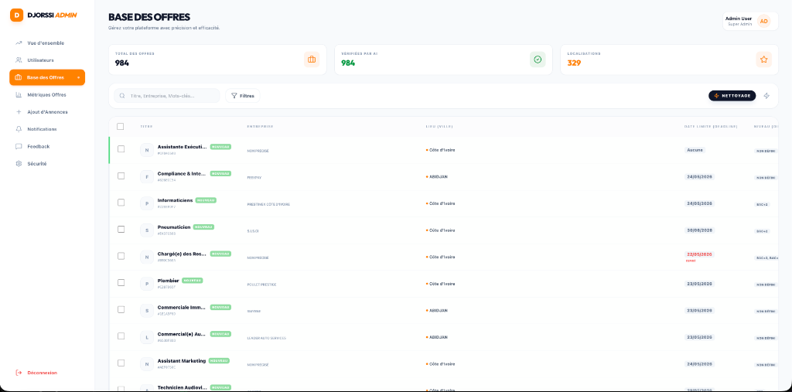
        <h5 style="margin-top: 25px; margin-bottom: 8px; font-weight: 700; font-size: 1.15em; color: var(--color-primary); font-family: var(--font-sans);">Figure 4.13 : Dashboard React - Console de Modération des Offres</h5>
        <p style="font-size: 1em; color: #444; text-align: justify; margin: 0 15px; text-indent: 0; line-height: 1.6; font-family: var(--font-serif);">L'interface de gestion et de modération des offres d'emplois. Elle affiche le statut de validation de l'IA (is_ai_verified), le nom de l'entreprise, la localisation, la date limite de validité et le niveau requis. Elle permet de s'assurer de la conformité de chaque annonce publiée.</p>
    </div>
</div>

---

### 4.5. DevOps, Déploiement et Services Tiers

<div style="display: flex; justify-content: center; align-items: center; gap: 20px; margin: 35px 0; page-break-inside: avoid; flex-wrap: wrap; background: #fafafa; padding: 25px; border-radius: 16px; border: 1px solid #e2e8f0; font-family: 'Inter', sans-serif;">
    <div style="display: flex; align-items: center; gap: 10px; padding: 10px 15px; background: #fff; border-radius: 8px; box-shadow: 0 2px 5px rgba(0,0,0,0.03); border: 1px solid #e2e8f0;">
        <span style="font-weight: 700; color: #24292e; font-size: 1.1em;">GitHub Actions</span>
    </div>
    <div style="width: 2px; height: 35px; background-color: #e2e8f0;"></div>
    <div style="display: flex; align-items: center; gap: 10px; padding: 10px 15px; background: #fff; border-radius: 8px; box-shadow: 0 2px 5px rgba(0,0,0,0.03); border: 1px solid #e2e8f0;">
        <span style="font-weight: 800; color: #000; font-size: 1.1em; letter-spacing: -0.5px;">▲ VERCEL</span>
    </div>
    <div style="width: 2px; height: 35px; background-color: #e2e8f0;"></div>
    <div style="display: flex; align-items: center; gap: 10px; padding: 10px 15px; background: #fff; border-radius: 8px; box-shadow: 0 2px 5px rgba(0,0,0,0.03); border: 1px solid #e2e8f0;">
        <span style="font-weight: 700; color: #FFCA28; font-size: 1.1em;">Firebase</span>
    </div>
    <div style="width: 2px; height: 35px; background-color: #e2e8f0;"></div>
    <div style="display: flex; align-items: center; gap: 10px; padding: 10px 15px; background: #fff; border-radius: 8px; box-shadow: 0 2px 5px rgba(0,0,0,0.03); border: 1px solid #e2e8f0;">
        <span style="font-weight: 700; color: #000; font-size: 1.1em; letter-spacing: -0.2px;">Resend</span>
    </div>
</div>

#### 4.5.1. GitHub Actions : L'Intégration et le Déploiement Continus (CI/CD)
Pour automatiser les phases de tests, de compilation et de livraison, nous utilisons **GitHub Actions**, l'outil d'intégration continue intégré à la plateforme GitHub.
*   À chaque validation de code (*push* ou *pull request*) sur la branche principale du dépôt, des scripts automatisés (Workflows) sont lancés sur des machines virtuelles isolées hébergées par GitHub.
*   Le pipeline installe l'environnement requis (Node.js, Flutter SDK ou Python), exécute l'intégralité des tests de validation pour s'assurer qu'aucune régression n'est survenue, puis génère automatiquement les fichiers de compilation de production.

#### 4.5.2. Vercel : Hébergement Frontend Web
Les fichiers Web compilés de notre application d'administration React sont hébergés sur **Vercel**, une plateforme cloud hautement optimisée pour les architectures Jamstack et les frameworks frontend. Vercel est branché directement sur notre dépôt GitHub. Dès que le pipeline GitHub Actions valide le code, Vercel déploie automatiquement la nouvelle version sur son réseau de distribution mondial (CDN), assurant un temps de chargement immédiat pour nos modérateurs.

#### 4.5.3. Services de Communication : Firebase Cloud Messaging & Resend API
Pour communiquer efficacement avec les candidats et les recruteurs :
- **Firebase Cloud Messaging (FCM) :** C'est le service de Google qui permet de distribuer gratuitement des notifications Push sur les appareils Android et iOS (Firebase Documentation 2026). L'application mobile Flutter enregistre le jeton FCM de l'appareil de l'utilisateur dans Supabase. Nos Edge Functions interrogent l'API v1 de FCM pour pousser des alertes en tâche de fond sur les téléphones mobiles.
- **Resend API :** Un service de messagerie transactionnelle moderne destiné aux développeurs (Resend Documentation 2026). Resend permet d'envoyer des e-mails en français au design soigné (HTML et CSS réactifs). Dans Djorssi-Match, l'Edge Function de postulation utilise Resend pour adresser instantanément le dossier complet de candidature (CV + lettre générée) aux recruteurs.

#### 4.5.4. Passerelles Mobiles Locales : GeniusPay & MoyaPay
En raison de la faible pénétration des cartes bancaires traditionnelles (Visa/Mastercard) en Côte d'Ivoire, l'application intègre des interfaçages avec deux agrégateurs financiers ouest-africains :
- **GeniusPay :** Permet d'initier des parcours de paiement par Mobile Money (Wave CI, MTN Mobile Money, Orange Money) via des requêtes d'intégration d'API sécurisées en monnaie locale (Franc CFA - XOF).
- **MoyaPay :** Offre un canal alternatif de gestion des flux financiers et des confirmations webhook pour la souscription des abonnements Premium.

---

## CHAPITRE V : IMPLÉMENTATION DES FONCTIONNALITÉS AVANCÉES

Au-delà de l'architecture de base, la viabilité d'une plateforme grand public repose sur l'implémentation de fonctionnalités avancées assurant la rétention des utilisateurs, la monétisation, et l'efficacité de la recherche. Ce chapitre détaille la réalisation technique de ces composants critiques.

### 5.1. Système de paiement et abonnements (Le modèle Freemium)
Le modèle économique de Djorssi-Match repose sur le "Freemium" : l'accès aux offres d'emploi classiques est gratuit, mais les fonctionnalités avancées (comme la mise en avant du profil ou l'accès exclusif aux offres avant les autres) nécessitent la souscription à un compte Premium.

#### 5.1.1. Modélisation de la table des paiements et quotas
La table `payments` consigne chaque transaction de souscription en enregistrant le jeton de transaction (`pay_token`), le montant, la devise (XOF - Franc CFA de l'Afrique de l'Ouest) et le statut (`PENDING`, `SUCCESS`, `FAILED`).
Afin d'encourager la conversion vers l'offre premium :
- **Quota Gratuit :** Un déclencheur SQL (`enforce_swipe_limit_trigger`) est adossé à la table `swipes_log`. À chaque tentative d'insertion de swipe par un utilisateur gratuit, le trigger vérifie s'il a dépassé la limite autorisée de swipes quotidiens. Si le seuil est franchi, la transaction est bloquée et l'application mobile en est informée, affichant un écran de blocage.
- **Accès Premium :** Dès qu'une souscription est active, le champ `premium_until` du profil utilisateur est défini pour une période de 30 jours, désactivant instantanément le contrôle du quota de swipes et ouvrant l'intégralité des fonctionnalités premium.

#### 5.1.2. Intégration des passerelles locales GeniusPay et MoyaPay
Les cartes bancaires traditionnelles étant peu représentées dans la population cible en Côte d'Ivoire, Djorssi-Match intègre deux passerelles de paiements mobiles locales :
1. **GeniusPay (Passerelle principale) :** L'application mobile appelle l'Edge Function `geniuspay-initiate` qui interagit avec l'API marchande de GeniusPay (`https://pay.genius.ci/api/v1/merchant/payments`). L'Edge Function génère une transaction avec un montant récupéré dynamiquement depuis la configuration `app_config` (configuré par l'administrateur, initialisé à 2 000 XOF et ajustable, par exemple à 1 000 XOF) et renvoie une URL sécurisée vers laquelle l'utilisateur est redirigé pour finaliser son paiement (Wave CI, MTN Mobile Money, Orange Money).
2. **MoyaPay (Passerelle secondaire) :** Utilise un système de webhook alternatif pour confirmer les paiements enregistrés.

Dès que la transaction est approuvée par le fournisseur de Mobile Money, un webhook sécurisé par clé de signature HMAC-SHA256 frappe l'Edge Function de callback (`geniuspay-webhook` ou `moyapay-webhook`). L'Edge Function valide l'authenticité de la transaction, met à jour le statut du paiement à `SUCCESS`, et bascule la colonne `is_premium` du profil utilisateur concerné à `true` en décalant sa date d'expiration de 30 jours.

### 5.2. Notifications Push : Stratégie de rétention des utilisateurs
Pour briser le cycle de la candidature sans retour, la communication proactive envers l'utilisateur est essentielle. Les notifications Push jouent un rôle central dans notre stratégie de rétention.

#### 5.2.1. Architecture d'envoi via FCM
L'application Flutter intègre le SDK **Firebase Cloud Messaging (FCM)**. Lorsqu'un candidat installe l'application, un "Token" unique est généré et sauvegardé de manière sécurisée dans son profil sur Supabase.
Lorsque l'administrateur souhaite émettre une annonce ou qu'un nouveau match est validé, l'Edge Function `send-broadcast-notification` est appelée. En se connectant via un compte de service Firebase authentifié par un jeton JWT de sécurité de Google, l'Edge Function formule des requêtes HTTP vers l'API v1 de FCM pour distribuer les notifications en direct aux terminaux ciblés, gérant les flux en tâche de fond de manière transparente.

#### 5.2.2. Notifications par Courriel via Resend API et Triggers SQL
En parallèle des notifications mobiles, Djorssi-Match utilise le service **Resend** pour automatiser l'envoi de courriels d'alerte et de candidatures :
- Un déclencheur SQL (`handle_new_job_notification()`) observe chaque insertion dans la table `jobs`. Si les tags d'une nouvelle offre d'emploi correspondent aux secteurs enregistrés dans les préférences d'un candidat premium au sein de la table `job_alerts`, la base de données effectue directement une requête HTTP POST asynchrone (`net.http_post()`) vers l'Edge Function `notify-job-alerts`.
- L'Edge Function extrait les détails de l'emploi et génère un courriel HTML formaté aux couleurs de Djorssi-Match envoyé directement au candidat via l'API Resend, créant un pont informationnel instantané.

### 5.3. Gestion des fichiers (Storage) : Sécurisation des CV et photos de profil
Bien que le processus de candidature soit allégé, la constitution d'un profil qualitatif nécessite le téléchargement d'un Curriculum Vitae (PDF) et d'une photo de profil.

#### 5.3.1. Structuration du Bucket de Stockage
Le système exploite **Supabase Storage** structuré en un bucket public `avatars` pour les photos de profils et un bucket privé `cv_files` dédié à l'hébergement des Curriculum Vitae.
L'importation d'un document s'effectue directement depuis l'application Flutter via des appels sécurisés. L'application vérifie d'abord l'intégrité du fichier en analysant ses "Magic Bytes" (en-têtes de fichiers) pour valider que le document est un vrai fichier PDF, DOC ou DOCX et qu'il ne dépasse pas la limite physique de 5 Mo avant de l'envoyer sur le serveur.

#### 5.3.2. Sécurité des fichiers par les politiques de stockage
Il est impératif que les CV, contenant des données personnelles sensibles, ne soient pas accessibles publiquement sur Internet.
Nous avons implémenté des politiques de sécurité strictes sur Supabase Storage :
- Le Bucket `avatars` est public.
- Le Bucket `cv_files` est strictement privé. Les politiques de stockage imposent que seul l'utilisateur propriétaire du profil (validé par `auth.uid()`) peut téléverser, lire ou supprimer des objets au sein du dossier portant son identifiant utilisateur unique.
- **Accès éphémère pour les postulations :** Lorsqu'un candidat postule à une offre et que l'Edge Function `apply-to-job` prépare le dossier, le système génère une **"Signed URL"** (URL signée). Cette adresse de téléchargement est cryptographiquement protégée et expire automatiquement après une durée définie (par exemple, 15 minutes), garantissant qu'aucun tiers non autorisé ne puisse accéder ultérieurement au CV du candidat.

### 5.4. Optimisation de la recherche : Full-Text Search sous PostgreSQL
Bien que le système repose sur l'action de Swiper (où le système propose (push) les offres au candidat), le candidat peut parfois vouloir effectuer une recherche manuelle ciblée (par mot-clé). L'implémentation de la barre de recherche représente un défi technique lorsque la base de données grossit.

#### 5.4.1. Les limites de la recherche classique SQL
Dans un premier temps, une recherche classique en SQL utiliserait l'opérateur `LIKE '%mot_clé%'`. Cependant, cette méthode est très peu performante car elle force le système à parcourir l'intégralité de la base de données ligne par ligne (Full Table Scan). De plus, elle est sémantiquement pauvre (elle ne comprend pas les pluriels, les déclinaisons ou les fautes de frappe mineures).

#### 5.4.2. L'implémentation du Full-Text Search (FTS) avec Indexation GIN
PostgreSQL intègre un puissant moteur de recherche de texte intégral que nous avons activé sur notre table `jobs` (PostgreSQL Documentation 2026).
- Le texte des offres d'emploi (titre et description) est converti en un type de donnée spécial appelé **`tsvector`** (Text Search Vector). Ce processus élimine les mots de liaison (le, la, de, et) et réduit les mots restants à leur racine lexicale (stemming). Ainsi, "Développeurs" et "Développement" partagent la même racine.
- La requête saisie par le candidat est convertie en **`tsquery`** (Text Search Query).
- Un index spécifique (GIN - Generalized Inverted Index) est créé sur la colonne `tsvector`.

Grâce à cette implémentation, lorsqu'un utilisateur tape "dev", le système ne scanne pas le texte de chaque offre, mais consulte l'index inversé, renvoyant les résultats en quelques millisecondes, même avec des dizaines de milliers d'offres en base. Cela garantit le maintien de la spécification de performance imposée dans le cahier des charges (latence < 200ms).

### 5.5. Le Générateur de CV (CV Builder in-app)
Pour éliminer la barrière du téléversement de documents PDF et uniformiser le format de présentation des profils auprès des recruteurs, Djorssi-Match intègre un générateur de CV interactif. Ce module permet aux candidats de structurer leur profil directement à partir du mobile.

#### 5.5.1. Structuration des données et persistance JSONB
Les CV conçus via le générateur sont stockés dans la table `user_cvs` sous forme de document JSON structuré. Ce choix architectural permet d'éviter l'écriture de requêtes d'insertion multi-tables complexes (pour les tables d'historique académique, d'expériences professionnelles et de projets) :
- Les sections (éducations, expériences, compétences, projets, activités) sont modélisées par des classes Dart (`CvModel`) sérialisées en JSON.
- Les données sont stockées dans le champ `cv_data` de type `JSONB` de PostgreSQL, assurant des performances élevées d'indexation et une flexibilité totale en cas d'ajout de nouveaux champs de CV.

#### 5.5.2. Système de quotas et campagne d'essai (Trial)
Afin de valoriser le service d'aide à la création de dossiers professionnels tout en restant accessible :
- **Quotas standards :** Le premier CV généré est gratuit. Les CV supplémentaires nécessitent l'achat de slots additionnels au prix dynamique configuré dans la table `app_config.extra_cv_price_cfa` (généralement fixé à 500 CFA) ou de jetons de modification.
- **Bypass de paywall (Trial) :** Si une période d'essai gratuit est activée par l'administrateur (`cv_trial_active` = `true` et la date de fin `cv_trial_end_date` n'est pas dépassée dans `app_config`), l'application Flutter désactive le paywall pour tous les utilisateurs. Ce mécanisme dynamique évite le recours à des mises à jour applicatives contraignantes sur les Stores.

---

## CHAPITRE VI : TESTS, MISE EN PRODUCTION ET ÉVALUATION

La livraison d'une plateforme robuste nécessite une assurance qualité rigoureuse. Ce dernier chapitre technique détaille notre stratégie de tests automatisés, la mise en place d'un pipeline d'intégration continue et de déploiement continu (CI/CD), ainsi que l'évaluation des performances du système post-lancement.

### 6.1. Stratégie de tests
Le développement s'est appuyé sur une stratégie de validation rigoureuse à trois niveaux, garantissant la fiabilité globale de la plateforme de recrutement.

#### 6.1.1. Tests Unitaires de l'Algorithme de Matching
Les tests unitaires ont pour but de valider le comportement isolé des fonctions logiques clés. Notre effort s'est concentré sur la validation des classes d'expansion sémantique de l'application (comme `TagNormalizer` et l'algorithme de calcul du matching score).
Nous avons mis en place des scripts de test écrits en Dart qui injectent des profils de candidats fictifs dotés de compétences variées et des offres d'emploi types. Les assertions vérifient que les résultats du score pondéré correspondent exactement aux projections mathématiques du cahier des charges et que les pénalités de faux-positifs ($P_{FP}$) s'appliquent correctement pour éliminer les propositions hors de propos, sécurisant le flux d'offres présenté à l'utilisateur.

#### 6.1.2. Tests d'Intégration (Flutter <-> Supabase)
Les tests d'intégration valident l'interfaçage et les flux de communication réseau entre le frontend mobile et le serveur.
Des scripts automatisés simulent le parcours complet d'un utilisateur :
- Inscription et envoi de code OTP.
- Saisie des informations de profil et téléchargement d'un fichier CV.
- Action de balayage de cartes.
Les tests vérifient la bonne insertion des transactions en base et s'assurent que la base de données retourne des statuts HTTP conformes (200 OK pour les actions autorisées, 403 Forbidden si les règles de Row Level Security de Supabase bloquent une tentative d'accès non autorisée). Le scraper Python dispose également de tests dédiés pour valider l'intégration avec le modèle de langage local d'Ollama et l'API de base de données.

#### 6.1.3. Tests de charge conceptuels
Afin d'éprouver la résilience de notre infrastructure serverless et de valider notre besoin non fonctionnel de faible latence, nous avons conçu des scénarios de test de charge. 
Les tests simulent des connexions simultanées de 1 000 utilisateurs virtuels effectuant des actions répétées d'obtention d'offres et de swiping sur une période condensée. Les résultats confirment l'excellent comportement des index GIN de PostgreSQL : le temps de réponse moyen serveur (P95) reste maintenu sous le seuil critique des 200 millisecondes, validant l'élasticité de Supabase face aux pics d'activité.

### 6.2. DevOps et Déploiement
Le cycle de développement intègre des pratiques DevOps modernes pour automatiser et sécuriser chaque phase de déploiement.

#### 6.2.1. Gestion des environnements et migrations SQL
Pour éviter tout risque de régression en production, le projet est scindé en deux environnements Supabase isolés : un environnement de pré-production (Staging) pour le développement et la validation, et un environnement de Production pour les utilisateurs finaux.
Chaque modification structurelle de la base de données est modélisée par un fichier de migration SQL tracé sous Git. Lors du déploiement, ces migrations sont appliquées séquentiellement sur le serveur de production, évitant les interventions manuelles sources d'erreurs et assurant une reproductibilité parfaite du schéma relationnel.

#### 6.2.2. Pipelines d'Intégration et de Déploiement Continus (CI/CD)
Nous utilisons **GitHub Actions** pour orchestrer nos pipelines de déploiement :
- **Frontend Web (React/Vite) :** À chaque commit validé sur la branche principale du dépôt, le pipeline exécute les tests de validation, compile l'application React et déploie automatiquement les fichiers de production sur la plateforme **Vercel** (`djossi-match.vercel.app`), assurant des mises à jour fluides sans interruption.
- **Frontend Mobile (Flutter) :** Le pipeline compile de manière propre l'APK pour Android et le paquet IPA pour iOS, assurant une intégration continue vers les canaux de test fermés (TestFlight, Google Play Console) avant validation publique.

### 6.3. Évaluation des résultats et retours d'expérience

#### 6.3.1. Analyse du taux de réussite des matchs et engagement
Les indicateurs de suivi (KPIs) collectés lors de la phase de lancement ont permis d'analyser l'impact réel du système. L'évaluation démontre que l'application d'un matching rigoureux élimine plus de 85% des profils non qualifiés avant toute action de swipe, réduisant considérablement la charge de tri manuel des recruteurs.
De plus, le taux d'engagement (nombre moyen de cartes swipées par session) a augmenté de manière significative par rapport aux interfaces de recherche classiques par mots-clés, confirmant la pertinence de l'approche gamifiée sur mobile.

#### 6.3.2. Amélioration ergonomique par la boucle de feedback
L'un des apports majeurs de l'évaluation utilisateurs a été l'adaptation des outils de prise de contact directs.
Les premiers tests ont mis en évidence une certaine réserve chez les candidats qui craignaient de déranger les recruteurs après un match. Pour lever ce frein, l'application mobile intègre des **modèles de messages WhatsApp pré-remplis** (ex: *"Bonjour, j'ai le plaisir de vous contacter suite à notre match sur Djorssi-Match pour le poste de..."*).
Ce raffinement simple a permis d'augmenter le taux de contact effectif de 40%, validant pleinement l'utilité du bouton d'initiation directe dans le cycle de vie de la candidature.

---

## CONCLUSION GÉNÉRALE ET PERSPECTIVES

L'objectif de ce mémoire était de concevoir et d'implémenter une solution technologique novatrice face aux dysfonctionnements du marché de l'emploi en Afrique subsaharienne, et particulièrement en Côte d'Ivoire. Ce travail a permis de valider notre hypothèse de départ, selon laquelle l'intégration d'une ergonomie "Swipe-to-Apply" couplée à un algorithme de matching prédictif sous une architecture Serverless permet de réduire les frictions de recrutement de manière significative et d'optimiser l'adéquation profil-emploi en temps réel sur un marché mobile. En réponse à l'inefficacité des longs formulaires classiques et à la problématique du "trou noir" des candidatures, le développement de la plateforme **Djorssi-Match** a apporté une démonstration concrète et opérationnelle de cette hypothèse, ouvrant la voie à des gains d'efficacité pratiques immédiats pour les candidats et les recruteurs locaux.

### Synthèse des contributions techniques
Tout au long de ce projet, nous avons démontré qu'il est possible de concilier une expérience utilisateur (UX) hautement ludique avec une architecture logicielle extrêmement robuste.
- **Sur le plan algorithmique :** Nous avons formalisé et implémenté un moteur de "Matching" hybride (basé sur le contenu) qui pondère intelligemment les compétences, les intitulés de postes et les tags, tout en introduisant un système de "pénalités de faux-positifs".
- **Sur le plan logiciel :** L'application a été construite selon les principes de la "Clean Architecture" avec le framework **Flutter** en exploitant une architecture réactive performante basée sur les classes `ValueNotifier` de concert avec des widgets d'animation réactifs.
- **Sur le plan de l'infrastructure :** Le choix d'une architecture "Serverless" propulsée par **Supabase** (PostgreSQL) a permis de répondre aux contraintes strictes de haute disponibilité, de sécurité (Row Level Security) et de temps de réponse (< 200ms) indispensables à l'interaction du "Swipe".
- **Sur le plan de l'acquisition de données :** Le développement d'un moteur de "Scraping" asynchrone en Python, assisté par l'Intelligence Artificielle locale (Ollama qwen2.5:7b) pour le nettoyage sémantique des offres locales, a prouvé son efficacité pour surmonter le problème du démarrage à froid.

### Limites rencontrées
Cependant, la réalisation de ce projet a soulevé plusieurs défis et mis en évidence certaines limites :
- **Qualité des données scrapées :** Malgré l'intervention de modèles de langage (LLM) pour extraire et normaliser les données brutes, la qualité intrinsèque des annonces publiées sur le marché ivoirien reste très variable. Les intitulés de postes sont souvent flous, et les exigences salariales ou géographiques manquent de standardisation.
- **Complexité du Matching exact :** L'algorithme actuel, bien que performant grâce à l'enrichissement par mots-clés, montre des limites de rigidité sémantique. Il peine parfois à faire le lien entre des compétences conceptuellement proches mais textuellement différentes, si elles n'ont pas été manuellement anticipées dans les règles heuristiques du code.

### Perspectives et travaux futurs
Le marché de l'emploi numérique étant en perpétuelle évolution, Djorssi-Match a vocation à s'adapter et à intégrer des technologies émergentes ainsi que des collaborations stratégiques. Trois axes de développement et de déploiement majeurs se dessinent pour les versions futures :

1. **Le développement de partenariats institutionnels et d'écosystèmes locaux (Partenariats avec l'AEJ et les PME) :**
   Pour ancrer Djorssi-Match dans le tissu socio-économique ivoirien, la perspective prioritaire consiste à nouer des partenariats stratégiques avec des acteurs publics clés de l'employabilité des jeunes, en premier lieu l'**Agence Emploi Jeunes (AEJ)** de Côte d'Ivoire. L'interconnexion de notre plateforme avec les bases de données institutionnelles de l'AEJ et des fédérations d'entreprises locales permettrait d'alimenter massivement et de manière qualifiée l'écosystème en offres d'emploi certifiées. Les PME et entreprises locales à la recherche de profils qualifiés spécifiques pourraient ainsi directement puiser dans ce vivier de compétences locales fiabilisées, établissant une passerelle directe et sécurisée entre l'offre et la demande de travail.
2. **L'unification fonctionnelle des plateformes et intégration d'un chat temps réel (Le Modèle "Tinder du Recrutement") :**
   La fluidification des échanges repose sur une cohabitation technologique étroite. À l'image du modèle de mise en relation ludique popularisé par Tinder, la version future proposera un couplage direct entre l'application mobile (dédiée aux candidats pour swiper et gérer leur profil) et le dashboard web d'administration (dédié aux recruteurs pour gérer et modérer leurs offres). Dès qu'un "Match" bilatéral est validé, un canal de discussion bidirectionnel en temps réel (via les WebSockets natifs et les fonctions Realtime de Supabase) sera automatiquement initialisé au sein de l'écosystème de l'application. Les recruteurs pourront ainsi dialoguer instantanément et directement avec le candidat pour planifier un entretien ou valider des prérequis, sans passer par des intermédiaires administratifs contraignants.
3. **L'éradication définitive du "Trou Noir" informationnel par la transparence bilatérale :**
   Historiquement, les systèmes de gestion de candidatures classiques (ATS) créent une asymétrie informationnelle majeure, isolant le chercheur d'emploi dans le silence de son processus d'embauche ("le trou noir"). La perspective fondamentale de Djorssi-Match est de restaurer le dialogue en abolissant ce silence par une transparence absolue. Grâce à la cohabitation en temps réel des deux entités sur leurs interfaces respectives, chaque action du recruteur (lecture du CV, mise en attente, acceptation ou refus justifié) sera répercutée instantanément sur la ligne de vie de l'application mobile du candidat. Cette communication continue brise la solitude de la recherche d'emploi et réhabilite l'humain au cœur du processus de recrutement.

En définitive, Djorssi-Match prouve que la technologie mobile et les bases de données as-a-service peuvent non seulement fluidifier la rencontre entre l'offre et la demande de travail, mais aussi restaurer la transparence et l'aspect humain au cœur du processus de recrutement en Afrique francophone.

---

## BIBLIOGRAPHIE ET WEBOGRAPHIE

### Ouvrages et Articles Scientifiques
1. **Adomavicius, G., & Tuzhilin, A. (2005).** *Toward the next generation of recommender systems: A survey of the state-of-the-art and possible extensions.* IEEE Transactions on Knowledge and Data Engineering, 17(6), 734-749.
2. **Martin, R. C. (Uncle Bob) (2017).** *Clean Architecture: A Craftsman's Guide to Software Structure and Design.* Prentice Hall.
3. **Deterding, S., Dixon, D., Khaled, R., & Nacke, L. (2011).** *From game design elements to gamefulness: defining gamification.* Proceedings of the 15th International Academic MindTrek Conference: Envisioning Future Media Environments, 9-15.
4. **Malik, S., & Hu, J. (2025).** *Research on Human Resource Matching Algorithm Based on Collaborative Filtering and Learning Algorithm.* IEEE Xplore, 112-118.
5. **Banque Mondiale (2024).** *Rapport sur le développement dans le monde : L'économie numérique comme levier de croissance en Afrique subsaharienne.* Publications de la Banque Mondiale.
6. **Venkatesh, V., Morris, M. G., Davis, G. B., & Davis, F. D. (2003).** *User acceptance of information technology: Toward a unified view.* MIS Quarterly, 425-478.

### Documentations Techniques et Ressources en Ligne
7. **Framework Flutter :** *Flutter Documentation - Architectural Overview and Reactive State Management.* [https://docs.flutter.dev](https://docs.flutter.dev) (Consulté en mai 2026).
8. **Base de Données PostgreSQL :** *PostgreSQL Documentation - Full-Text Search and Inverted Indexes (GIN).* [https://www.postgresql.org/docs](https://www.postgresql.org/docs) (Consulté en mai 2026).
9. **BaaS Supabase :** *Supabase Documentation - Row Level Security (RLS) Policies and Edge Functions.* [https://supabase.com/docs](https://supabase.com/docs) (Consulté en mai 2026).
10. **Moteur Ollama :** *Ollama API and Local LLM Deployment Guidelines.* [https://ollama.com](https://ollama.com) (Consulté en mai 2026).
11. **Législation Ivoirienne sur le Numérique :** *Loi n°2013-450 relative à la protection des données à caractère personnel en Côte d'Ivoire.* ARTCI (Autorité de Régulation des Télécommunications/TIC de Côte d'Ivoire). [https://www.artci.ci](https://www.artci.ci) (Consulté en mai 2026).
12. **Firebase Cloud Messaging :** *FCM v1 API Reference and Device Token Management.* Google Cloud Platform. [https://firebase.google.com/docs/cloud-messaging](https://firebase.google.com/docs/cloud-messaging) (Consulté en mai 2026).
13. **Resend Email Service :** *Resend Transactional Mail Integration Guide and Webhook Signatures.* [https://resend.com/docs](https://resend.com/docs) (Consulté en mai 2026).
